# Feature Flags

> **TL;DR:** Dynamic feature flag management service enabling safe rollouts, A/B testing, and runtime configuration control

## 📊 **Architecture Overview**

### 🚩 **Where it fits** - Feature Control Hub

```mermaid
graph TB
    subgraph "Feature Consumers"
        FleetManager[🚛 Fleet Manager]
        VehicleGateway[🌐 Vehicle Gateway]
        ControlCenter[🖥️ Control Center UI]
        MobileApp[📱 Mobile App]
        EdgeStack[🤖 Edge Stack]
    end
    
    subgraph "Feature Flags Service"
        FlagEngine[🚩 Flag Engine]
        ConfigManager[⚙️ Config Manager]
        ABTestManager[🧪 A/B Test Manager]
        TargetingEngine[🎯 Targeting Engine]
        FlagAPI[🔌 Flag API]
    end
    
    subgraph "Storage & Cache"
        FlagStore[(🗄️ Flag Store)]
        RedisCache[(⚡ Redis Cache)]
        ConfigHistory[(📚 Config History)]
    end
    
    subgraph "Management Interface"
        AdminUI[👑 Admin UI]
        CLI[⌨️ CLI Tool]
        APIClient[🔌 API Client]
        Webhooks[🔗 Webhooks]
    end
    
    subgraph "Analytics & Monitoring"
        FlagAnalytics[📊 Flag Analytics]
        ABResults[📈 A/B Test Results]
        UsageMetrics[📋 Usage Metrics]
        AlertSystem[🚨 Alert System]
    end
    
    FleetManager --> FlagAPI
    VehicleGateway --> FlagAPI
    ControlCenter --> FlagAPI
    MobileApp --> FlagAPI
    EdgeStack --> FlagAPI
    
    FlagAPI --> FlagEngine
    FlagEngine --> ConfigManager
    FlagEngine --> ABTestManager
    FlagEngine --> TargetingEngine
    
    ConfigManager --> FlagStore
    FlagEngine --> RedisCache
    ABTestManager --> ConfigHistory
    
    AdminUI --> FlagAPI
    CLI --> FlagAPI
    APIClient --> FlagAPI
    Webhooks --> FlagAPI
    
    FlagEngine --> FlagAnalytics
    ABTestManager --> ABResults
    FlagAPI --> UsageMetrics
    TargetingEngine --> AlertSystem
    
    classDef consumer fill:#e8f5e8,stroke:#1b5e20,stroke-width:2px
    classDef service fill:#e1f5fe,stroke:#01579b,stroke-width:3px
    classDef storage fill:#fff3e0,stroke:#f57c00,stroke-width:2px
    classDef management fill:#f3e5f5,stroke:#7b1fa2,stroke-width:2px
    classDef analytics fill:#ffebee,stroke:#c62828,stroke-width:2px
    
    class FleetManager,VehicleGateway,ControlCenter,MobileApp,EdgeStack consumer
    class FlagEngine,ConfigManager,ABTestManager,TargetingEngine,FlagAPI service
    class FlagStore,RedisCache,ConfigHistory storage
    class AdminUI,CLI,APIClient,Webhooks management
    class FlagAnalytics,ABResults,UsageMetrics,AlertSystem analytics
```


### ⚡ **How it talks** - Feature Flag Evaluation

```mermaid
sequenceDiagram
    autonumber
    participant Service as 🚛 Fleet Manager
    participant API as 🚩 Flag API
    participant Engine as 🚩 Flag Engine
    participant Cache as ⚡ Redis Cache
    participant Targeting as 🎯 Targeting Engine
    participant Analytics as 📊 Flag Analytics
    
    Service->>API: GET /flags/evaluate
    Note right of Service: Request: user_id, context
    
    API->>Cache: Check flag cache
    Note right of API: Fast flag lookup
    
    alt Cache hit
        Cache-->>API: Cached flag values
        Note right of Cache: <1ms cache response
    else Cache miss
        API->>Engine: Evaluate flags
        Note right of API: Full flag evaluation
        
        Engine->>Targeting: Check user targeting
        Note right of Engine: User segmentation rules
        
        Targeting->>Targeting: Evaluate targeting rules
        Note right of Targeting: Percentage rollouts, user attributes
        
        Targeting-->>Engine: Targeting result
        Engine-->>API: Flag evaluation result
        
        API->>Cache: Store in cache (TTL: 5min)
        Note right of API: Cache for future requests
    end
    
    API->>Analytics: Log flag evaluation
    Note right of API: Usage analytics and metrics
    
    API-->>Service: Flag values + metadata
    Note right of API: JSON response with flags
    
    Service->>Service: Apply feature logic
    Note right of Service: Enable/disable features
    
    alt A/B test flag
        Service->>Analytics: Log A/B test event
        Note right of Service: Conversion tracking
    end
    
    Note over Service,Analytics: <10ms flag evaluation latency
```


### 🎯 **What it owns** - Feature Control & Targeting

```mermaid
flowchart TB
    subgraph "Flag Types"
        BooleanFlags[✅ Boolean Flags<br/>Simple on/off switches]
        StringFlags[📝 String Flags<br/>Configuration values]
        NumberFlags[🔢 Number Flags<br/>Numeric parameters]
        JSONFlags[📋 JSON Flags<br/>Complex configurations]
    end
    
    subgraph "Targeting Rules"
        UserTargeting[👤 User Targeting<br/>User ID, attributes]
        PercentageRollout[📊 Percentage Rollout<br/>Gradual feature release]
        GeographicTargeting[🌍 Geographic Targeting<br/>Location-based rules]
        DeviceTargeting[📱 Device Targeting<br/>Platform-specific flags]
    end
    
    subgraph "A/B Testing"
        ExperimentDesign[🧪 Experiment Design<br/>Hypothesis and variants]
        TrafficSplitting[🔀 Traffic Splitting<br/>Control vs treatment]
        StatisticalAnalysis[📈 Statistical Analysis<br/>Significance testing]
        ConversionTracking[🎯 Conversion Tracking<br/>Goal measurement]
    end
    
    subgraph "Safety Controls"
        KillSwitches[🛑 Kill Switches<br/>Emergency feature disable]
        RollbackMechanism[⏪ Rollback Mechanism<br/>Instant feature revert]
        CircuitBreakers[🔌 Circuit Breakers<br/>Automatic failure protection]
        CanaryReleases[🐤 Canary Releases<br/>Safe feature deployment]
    end
    
    subgraph "Management Features"
        ScheduledFlags[⏰ Scheduled Flags<br/>Time-based activation]
        DependencyFlags[🔗 Dependency Flags<br/>Feature prerequisites]
        EnvironmentFlags[🌍 Environment Flags<br/>Dev/staging/prod variants]
        AuditTrail[📋 Audit Trail<br/>Change history tracking]
    end
    
    BooleanFlags --> UserTargeting
    StringFlags --> PercentageRollout
    NumberFlags --> GeographicTargeting
    JSONFlags --> DeviceTargeting
    
    UserTargeting --> ExperimentDesign
    PercentageRollout --> TrafficSplitting
    GeographicTargeting --> StatisticalAnalysis
    DeviceTargeting --> ConversionTracking
    
    ExperimentDesign --> KillSwitches
    TrafficSplitting --> RollbackMechanism
    StatisticalAnalysis --> CircuitBreakers
    ConversionTracking --> CanaryReleases
    
    KillSwitches --> ScheduledFlags
    RollbackMechanism --> DependencyFlags
    CircuitBreakers --> EnvironmentFlags
    CanaryReleases --> AuditTrail
    
    classDef flags fill:#e3f2fd,stroke:#1976d2,stroke-width:2px
    classDef targeting fill:#e8f5e8,stroke:#388e3c,stroke-width:2px
    classDef testing fill:#fff3e0,stroke:#f57c00,stroke-width:2px
    classDef safety fill:#ffebee,stroke:#c62828,stroke-width:2px
    classDef management fill:#f3e5f5,stroke:#7b1fa2,stroke-width:2px
    
    class BooleanFlags,StringFlags,NumberFlags,JSONFlags flags
    class UserTargeting,PercentageRollout,GeographicTargeting,DeviceTargeting targeting
    class ExperimentDesign,TrafficSplitting,StatisticalAnalysis,ConversionTracking testing
    class KillSwitches,RollbackMechanism,CircuitBreakers,CanaryReleases safety
    class ScheduledFlags,DependencyFlags,EnvironmentFlags,AuditTrail management
```


## 🔗 **API Contracts**

| Endpoint | Method | Description |
|----------|--------|-------------|
| `/api/v1/flags/evaluate` | `POST` | Evaluate flags for user context |
| `/api/v1/flags` | `GET` | List all feature flags |
| `/api/v1/flags/{key}` | `PUT` | Update feature flag |
| `/api/v1/experiments` | `GET` | List A/B test experiments |

## 🚀 **Quick Start**

```bash
# Start feature flags service
make dev.feature-flags

# Evaluate flags for user
curl -X POST http://localhost:8080/api/v1/flags/evaluate \
  -H "Content-Type: application/json" \
  -d '{"user_id":"user123","context":{"country":"UAE","device":"mobile"}}'

# Create a new feature flag
curl -X POST http://localhost:8080/api/v1/flags \
  -H "Content-Type: application/json" \
  -d '{"key":"new_dashboard","type":"boolean","default_value":false}'

# Health check
curl http://localhost:8080/health
```

## 📈 **SLOs & Performance**

| Metric | Target | Current |
|--------|--------|---------|
| **Flag Evaluation** | <10ms | 7ms ✅ |
| **Cache Hit Rate** | >95% | 97% ✅ |
| **Availability** | 99.99% | 99.995% ✅ |
| **Throughput** | 100K req/s | 85K req/s ✅ |

## 🚩 **Feature Flag Categories**

### **Operational Flags**
- **Emergency Controls** - Kill switches for critical features
- **Performance Tuning** - Runtime performance parameters
- **Capacity Management** - Load balancing and scaling controls
- **Maintenance Mode** - Service maintenance toggles

### **Product Flags**
- **New Features** - Gradual rollout of new functionality
- **UI/UX Changes** - Interface modifications and improvements
- **Algorithm Variants** - Different algorithm implementations
- **Integration Toggles** - Third-party service integrations

### **A/B Testing**
```yaml
# Example A/B Test Configuration
experiments:
  new_routing_algorithm:
    hypothesis: "New routing reduces trip time by 15%"
    variants:
      control: 50%    # Current algorithm
      treatment: 50%  # New algorithm
    success_metrics:
      - trip_duration
      - fuel_efficiency
    duration: 14d
```

## 🛡️ **Safety & Governance**

### **Safety Controls**
- **Kill Switches** - Instant feature disable capability
- **Rollback Mechanisms** - Automatic revert on failure detection
- **Circuit Breakers** - Automatic protection against cascading failures
- **Approval Workflows** - Multi-stage approval for production changes

### **Governance**
- **Change Auditing** - Complete history of flag modifications
- **Access Control** - Role-based permissions for flag management
- **Environment Isolation** - Separate flag configurations per environment
- **Compliance Tracking** - Regulatory compliance for feature changes

## 📊 **Analytics & Monitoring**

- **Flag Dashboard** - [Feature Flag Analytics](https://grafana.atlasmesh.com/d/feature-flags)
- **A/B Test Results** - Statistical significance and conversion metrics
- **Usage Analytics** - Flag evaluation patterns and performance
- **Business Impact** - Feature adoption and business metrics correlation

## 🆘 **Troubleshooting**

| Issue | Solution |
|-------|----------|
| Slow flag evaluation | Check Redis cache performance, optimize targeting rules |
| Inconsistent flag values | Verify cache TTL settings, check flag propagation |
| A/B test bias | Review randomization algorithm, check user segmentation |
| High cache misses | Optimize cache warming, review cache eviction policies |

---

**🎯 Owner:** Platform Engineering Team | **📧 Contact:** platform-team@atlasmesh.com
