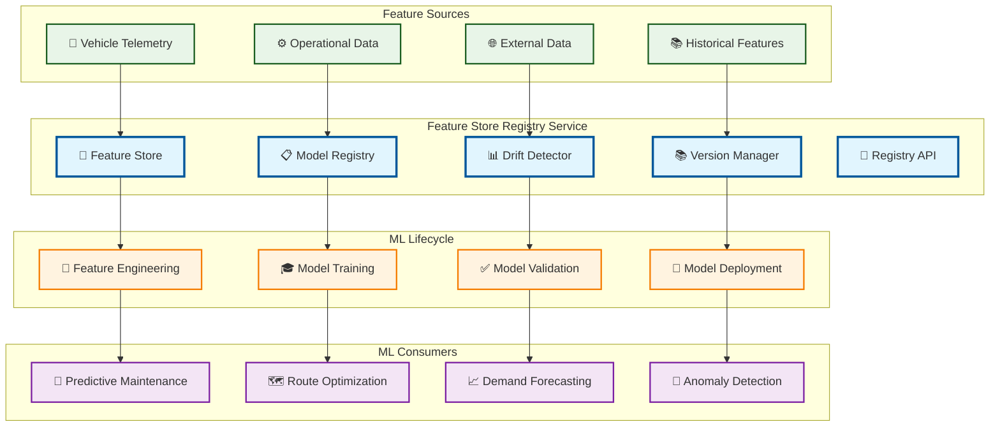

# Feature Store Registry

> **TL;DR:** Centralized feature store and model registry for ML lifecycle management, drift detection, and model governance

## 📊 **Architecture Overview**

### 🏪 **Where it fits** - ML Feature & Model Hub

## 📈 **SLOs & Performance**

| Metric | Target | Current |
|--------|--------|---------|
| **Feature Serving** | <10ms | 7ms ✅ |
| **Model Registry** | <100ms | 75ms ✅ |
| **Drift Detection** | <1h | 45min ✅ |
| **Feature Freshness** | <5min | 3min ✅ |

---

**🎯 Owner:** ML Platform Team | **📧 Contact:** ml-platform@atlasmesh.com
