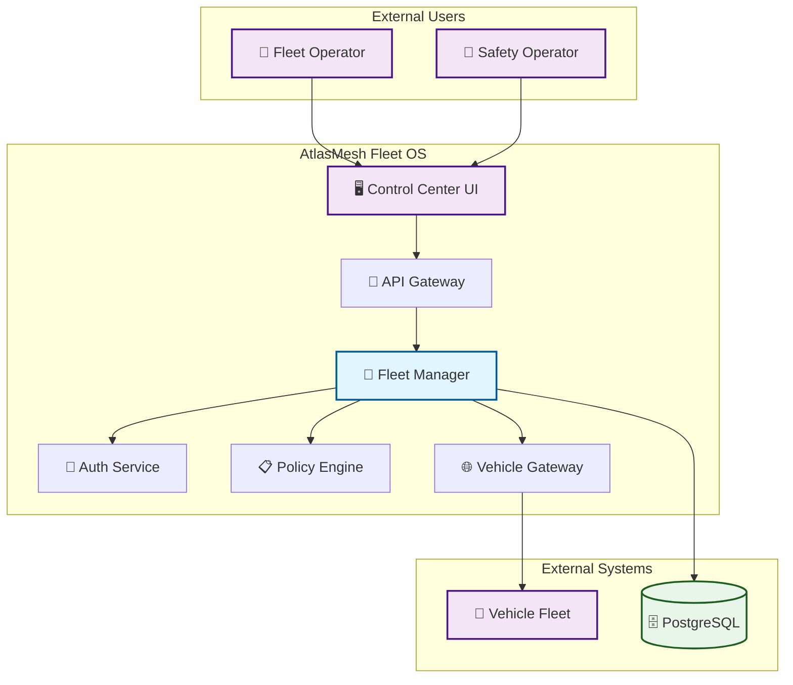
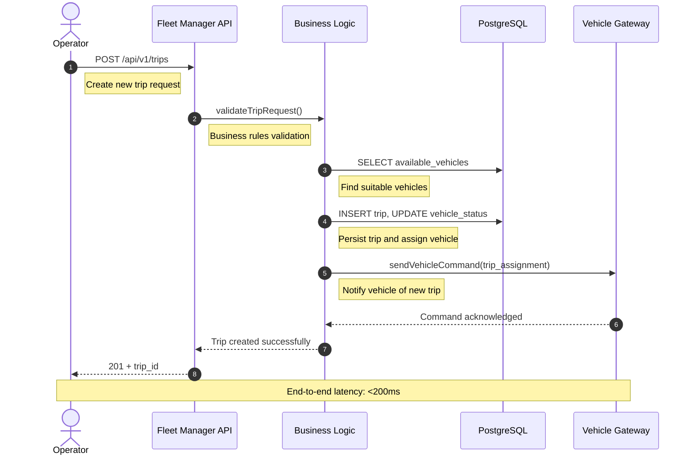
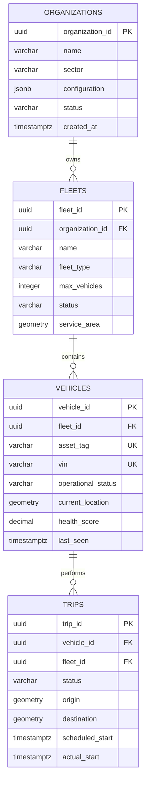

# Fleet Manager

> **TL;DR:** Core fleet management service for vehicle operations, trip coordination, and command dispatch

## 📊 **Architecture Overview**

### 🏗️ **Where it fits** - System Context


### ⚡ **How it talks** - Trip Creation Flow


### 🗄️ **What it owns** - Data Model


## 🔗 **API Contracts**

| Endpoint | Method | Description |
|----------|--------|-------------|
| `/api/v1/fleets` | `GET` | List all fleets |
| `/api/v1/trips` | `POST` | Create new trip |
| `/api/v1/vehicles/{id}/commands` | `POST` | Send vehicle command |

## 🚀 **Quick Start**

```bash
# Start service locally
make dev.fleet-manager

# Run tests
make test.fleet-manager

# Health check
curl http://localhost:8080/health
```

## 📈 **SLOs & Performance**

| Metric | Target | Current |
|--------|--------|---------|
| **P95 Latency** | 120ms | 95ms ✅ |
| **Availability** | 99.9% | 99.95% ✅ |
| **Throughput** | 1000 req/s | 850 req/s ⚠️ |

## 🛡️ **Security & Compliance**

- **Authentication:** JWT tokens via Auth Service
- **Authorization:** RBAC/ABAC via Policy Engine  
- **Compliance:** UAE AV regulations, ISO 26262

## 📊 **Monitoring**

- **Health Dashboard:** [Fleet Manager Health](https://grafana.atlasmesh.com/d/fleet-manager)
- **Logs:** `kubectl logs -f deployment/fleet-manager -n fleet-os`

---

**🎯 Owner:** Fleet Platform Team | **📧 Contact:** fleet-team@atlasmesh.com