# Garage Tools

> **TL;DR:** Comprehensive garage management service for vehicle maintenance, flashing, SBOM attestation, and depot operations

## 📊 **Architecture Overview**

### 🏭 **Where it fits** - Garage Operations Hub

```mermaid
graph TB
    subgraph "Physical Garage"
        Vehicles[🚗 Fleet Vehicles]
        Technicians[👨‍🔧 Technicians]
        Equipment[🔧 Garage Equipment]
        Parts[📦 Parts Inventory]
    end
    
    subgraph "Garage Tools Service"
        GarageAPI[🏭 Garage API]
        FlashingService[⚡ Flashing Service]
        SBOMAttestation[📋 SBOM Attestation]
        DepotManager[📦 Depot Manager]
        MaintenanceScheduler[📅 Maintenance Scheduler]
    end
    
    subgraph "Vehicle Operations"
        OTAUpdates[📲 OTA Updates]
        DiagnosticScans[🔍 Diagnostic Scans]
        CalibrationTools[⚖️ Calibration Tools]
        TestingFramework[🧪 Testing Framework]
    end
    
    subgraph "Data Management"
        VehicleProfiles[🚗 Vehicle Profiles]
        MaintenanceRecords[📋 Maintenance Records]
        SoftwareVersions[💻 Software Versions]
        ComplianceCerts[📜 Compliance Certificates]
    end
    
    subgraph "Integration Points"
        FleetManager[🚛 Fleet Manager]
        PredictiveMaintenance[🔮 Predictive Maintenance]
        InventorySystem[📦 Inventory System]
        ComplianceSystem[📋 Compliance System]
    end
    
    Vehicles --> GarageAPI
    Technicians --> GarageAPI
    Equipment --> GarageAPI
    Parts --> GarageAPI
    
    GarageAPI --> FlashingService
    GarageAPI --> SBOMAttestation
    GarageAPI --> DepotManager
    GarageAPI --> MaintenanceScheduler
    
    FlashingService --> OTAUpdates
    SBOMAttestation --> DiagnosticScans
    DepotManager --> CalibrationTools
    MaintenanceScheduler --> TestingFramework
    
    OTAUpdates --> VehicleProfiles
    DiagnosticScans --> MaintenanceRecords
    CalibrationTools --> SoftwareVersions
    TestingFramework --> ComplianceCerts
    
    GarageAPI --> FleetManager
    MaintenanceScheduler --> PredictiveMaintenance
    DepotManager --> InventorySystem
    SBOMAttestation --> ComplianceSystem
    
    classDef physical fill:#e8f5e8,stroke:#1b5e20,stroke-width:2px
    classDef garage fill:#e1f5fe,stroke:#01579b,stroke-width:3px
    classDef operations fill:#fff3e0,stroke:#f57c00,stroke-width:2px
    classDef data fill:#f3e5f5,stroke:#7b1fa2,stroke-width:2px
    classDef integration fill:#ffebee,stroke:#c62828,stroke-width:2px
    
    class Vehicles,Technicians,Equipment,Parts physical
    class GarageAPI,FlashingService,SBOMAttestation,DepotManager,MaintenanceScheduler garage
    class OTAUpdates,DiagnosticScans,CalibrationTools,TestingFramework operations
    class VehicleProfiles,MaintenanceRecords,SoftwareVersions,ComplianceCerts data
    class FleetManager,PredictiveMaintenance,InventorySystem,ComplianceSystem integration
```


### ⚡ **How it talks** - Vehicle Maintenance Workflow

```mermaid
sequenceDiagram
    autonumber
    participant Vehicle as 🚗 Vehicle AV-001
    participant Technician as 👨‍🔧 Technician
    participant Garage as 🏭 Garage Tools
    participant Flash as ⚡ Flashing Service
    participant SBOM as 📋 SBOM Attestation
    participant Fleet as 🚛 Fleet Manager
    
    Note over Vehicle,Fleet: Scheduled Maintenance Entry
    Fleet->>Garage: Schedule maintenance for AV-001
    Note right of Fleet: Predictive maintenance recommendation
    
    Garage->>Garage: Create maintenance work order
    Note right of Garage: Work order with tasks and parts
    
    Technician->>Garage: Check-in vehicle AV-001
    Note right of Technician: Vehicle arrival at garage
    
    Garage->>Vehicle: Connect diagnostic tools
    Note right of Garage: OBD-II and proprietary diagnostics
    
    Vehicle-->>Garage: Vehicle diagnostic data
    Note right of Vehicle: System health, error codes
    
    Note over Vehicle,Fleet: Software Update Process
    Garage->>Flash: Check for software updates
    Note right of Garage: Latest firmware versions
    
    Flash->>Flash: Prepare update package
    Note right of Flash: A/B deployment strategy
    
    Flash->>Vehicle: Flash new firmware
    Note right of Flash: Secure OTA update
    
    Vehicle->>Vehicle: Install and verify update
    Note right of Vehicle: Boot verification and testing
    
    Vehicle-->>Flash: Update successful
    Flash->>SBOM: Generate software attestation
    Note right of Flash: Software Bill of Materials
    
    SBOM->>SBOM: Create cryptographic attestation
    Note right of SBOM: Signed SBOM with provenance
    
    SBOM-->>Garage: Attestation complete
    
    Note over Vehicle,Fleet: Maintenance Completion
    Garage->>Garage: Complete maintenance tasks
    Note right of Garage: Physical maintenance work
    
    Garage->>Fleet: Update vehicle status
    Note right of Garage: Maintenance complete, ready for service
    
    Fleet->>Fleet: Return vehicle to active fleet
    Note right of Fleet: Vehicle available for dispatch
    
    Note over Vehicle,Fleet: Complete maintenance lifecycle with attestation
```


### 🔧 **What it owns** - Garage Operations & Tools

```mermaid
flowchart TB
    subgraph "Maintenance Operations"
        ScheduledMaintenance[📅 Scheduled Maintenance<br/>Preventive maintenance tasks]
        EmergencyRepairs[🚨 Emergency Repairs<br/>Unplanned maintenance]
        Inspections[🔍 Inspections<br/>Safety and compliance checks]
        Calibrations[⚖️ Calibrations<br/>Sensor and system calibration]
    end
    
    subgraph "Software Management"
        FirmwareFlashing[⚡ Firmware Flashing<br/>ECU and system updates]
        OTADeployment[📲 OTA Deployment<br/>Over-the-air updates]
        SoftwareRollback[⏪ Software Rollback<br/>Version rollback capability]
        VersionControl[📚 Version Control<br/>Software version tracking]
    end
    
    subgraph "Quality Assurance"
        SBOMGeneration[📋 SBOM Generation<br/>Software bill of materials]
        SecurityAttestation[🔐 Security Attestation<br/>Cryptographic verification]
        ComplianceTesting[📜 Compliance Testing<br/>Regulatory compliance]
        QualityGates[✅ Quality Gates<br/>Release validation]
    end
    
    subgraph "Depot Operations"
        PartsManagement[📦 Parts Management<br/>Inventory and ordering]
        ToolManagement[🔧 Tool Management<br/>Equipment tracking]
        WorkOrderSystem[📋 Work Order System<br/>Task management]
        TechnicianScheduling[👨‍🔧 Technician Scheduling<br/>Resource allocation]
    end
    
    subgraph "Integration & Analytics"
        FleetIntegration[🚛 Fleet Integration<br/>Fleet management system]
        PredictiveAnalytics[🔮 Predictive Analytics<br/>Maintenance forecasting]
        CostTracking[💰 Cost Tracking<br/>Maintenance cost analysis]
        PerformanceMetrics[📊 Performance Metrics<br/>KPI tracking and reporting]
    end
    
    ScheduledMaintenance --> FirmwareFlashing
    EmergencyRepairs --> OTADeployment
    Inspections --> SoftwareRollback
    Calibrations --> VersionControl
    
    FirmwareFlashing --> SBOMGeneration
    OTADeployment --> SecurityAttestation
    SoftwareRollback --> ComplianceTesting
    VersionControl --> QualityGates
    
    SBOMGeneration --> PartsManagement
    SecurityAttestation --> ToolManagement
    ComplianceTesting --> WorkOrderSystem
    QualityGates --> TechnicianScheduling
    
    PartsManagement --> FleetIntegration
    ToolManagement --> PredictiveAnalytics
    WorkOrderSystem --> CostTracking
    TechnicianScheduling --> PerformanceMetrics
    
    classDef maintenance fill:#e8f5e8,stroke:#388e3c,stroke-width:2px
    classDef software fill:#e3f2fd,stroke:#1976d2,stroke-width:2px
    classDef quality fill:#fff3e0,stroke:#f57c00,stroke-width:2px
    classDef depot fill:#f3e5f5,stroke:#7b1fa2,stroke-width:2px
    classDef integration fill:#ffebee,stroke:#c62828,stroke-width:2px
    
    class ScheduledMaintenance,EmergencyRepairs,Inspections,Calibrations maintenance
    class FirmwareFlashing,OTADeployment,SoftwareRollback,VersionControl software
    class SBOMGeneration,SecurityAttestation,ComplianceTesting,QualityGates quality
    class PartsManagement,ToolManagement,WorkOrderSystem,TechnicianScheduling depot
    class FleetIntegration,PredictiveAnalytics,CostTracking,PerformanceMetrics integration
```


## 🔗 **API Contracts**

| Endpoint | Method | Description |
|----------|--------|-------------|
| `/api/v1/vehicles/{id}/checkin` | `POST` | Check vehicle into garage |
| `/api/v1/maintenance/workorders` | `GET` | List maintenance work orders |
| `/api/v1/flashing/update` | `POST` | Flash vehicle firmware |
| `/api/v1/sbom/generate` | `POST` | Generate SBOM attestation |

## 🚀 **Quick Start**

```bash
# Start garage tools service
make dev.garage-tools

# Check vehicle into garage
curl -X POST http://localhost:8080/api/v1/vehicles/AV-001/checkin \
  -H "Content-Type: application/json" \
  -d '{"technician_id":"tech123","maintenance_type":"scheduled"}'

# Create work order
curl -X POST http://localhost:8080/api/v1/maintenance/workorders \
  -H "Content-Type: application/json" \
  -d '{"vehicle_id":"AV-001","tasks":["oil_change","brake_inspection"]}'

# Health check
curl http://localhost:8080/health
```

## 📈 **SLOs & Performance**

| Metric | Target | Current |
|--------|--------|---------|
| **Maintenance Completion Time** | <4 hours | 3.2 hours ✅ |
| **Firmware Flash Success Rate** | >99% | 99.5% ✅ |
| **SBOM Generation Time** | <5 minutes | 3.5 minutes ✅ |
| **System Availability** | 99.9% | 99.95% ✅ |

## 🏭 **Garage Operations**

### **Maintenance Types**
- **Scheduled Maintenance** - Preventive maintenance based on mileage/time
- **Predictive Maintenance** - AI-driven maintenance recommendations
- **Emergency Repairs** - Unplanned maintenance for breakdowns
- **Compliance Inspections** - Regulatory and safety inspections

### **Software Management**
```yaml
# Firmware Update Configuration
firmware_update:
  strategy: "blue_green"
  rollback_timeout: "30m"
  verification_tests:
    - boot_test
    - sensor_calibration
    - communication_test
  
  quality_gates:
    - sbom_generation
    - security_scan
    - compliance_check
```

### **SBOM Attestation**
- **Software Inventory** - Complete software component listing
- **Vulnerability Scanning** - Security vulnerability assessment
- **License Compliance** - Open source license validation
- **Cryptographic Signing** - Tamper-proof attestation

## 🛡️ **Security & Compliance**

### **Secure Flashing**
- **Cryptographic Verification** - Signed firmware packages
- **Secure Boot** - Verified boot process
- **Rollback Protection** - Anti-rollback mechanisms
- **Audit Trail** - Complete update history

### **Compliance Standards**
- **ISO 26262** - Functional safety for automotive
- **UNECE WP.29** - Cybersecurity and software update regulations
- **NHTSA Guidelines** - US Department of Transportation requirements
- **UAE Standards** - Local regulatory compliance

## 📊 **Analytics & Reporting**

- **Garage Dashboard** - [Maintenance Operations](https://grafana.atlasmesh.com/d/garage-tools)
- **Maintenance Analytics** - Cost analysis, efficiency metrics
- **Software Metrics** - Update success rates, rollback frequency
- **Compliance Reporting** - Regulatory compliance status

## 🆘 **Troubleshooting**

| Issue | Solution |
|-------|----------|
| Firmware flash failures | Check vehicle connectivity, verify firmware integrity |
| SBOM generation errors | Review software inventory, check signing certificates |
| Maintenance delays | Optimize parts inventory, improve technician scheduling |
| Compliance violations | Review test procedures, update quality gates |

---

**🎯 Owner:** Garage Operations Team | **📧 Contact:** garage-ops@atlasmesh.com
