# Key Secret Management

> **TL;DR:** Centralized secrets management service using HashiCorp Vault for secure storage, rotation, and access control of sensitive data

## 📊 **Architecture Overview**

### 🔐 **Where it fits** - Secrets Management Hub


### ⚡ **How it talks** - Secret Lifecycle Management

```mermaid
sequenceDiagram
    autonumber
    participant Service as 🚛 Fleet Manager
    participant API as 🔌 Secret API
    participant Vault as 🔐 Vault Cluster
    participant Auth as 🆔 Auth Engine
    participant Engine as 🔑 Secret Engine
    participant DB as 🗄️ PostgreSQL
    
    Note over Service,DB: Service Authentication
    Service->>API: Request database credentials
    Note right of Service: Service needs DB access
    
    API->>Auth: Authenticate service
    Note right of API: Kubernetes service account token
    
    Auth->>Auth: Validate service identity
    Note right of Auth: K8s token verification
    
    Auth-->>API: Authentication successful
    Note right of Auth: Service identity confirmed
    
    Note over Service,DB: Dynamic Secret Generation
    API->>Engine: Request database credentials
    Note right of API: Dynamic secret request
    
    Engine->>DB: CREATE USER temp_user_12345
    Note right of Engine: Create temporary DB user
    
    DB-->>Engine: User created successfully
    Engine->>Engine: Generate credentials
    Note right of Engine: Username + password + TTL
    
    Engine-->>API: Dynamic credentials
    Note right of Engine: TTL: 1 hour
    
    API-->>Service: Database credentials
    Note right of API: Temporary access credentials
    
    Note over Service,DB: Secret Usage & Rotation
    Service->>DB: Connect using credentials
    Note right of Service: Use temporary credentials
    
    loop Every 30 minutes
        Engine->>Engine: Check credential TTL
        Note right of Engine: Automatic rotation check
        
        alt TTL expired
            Engine->>DB: DROP USER temp_user_12345
            Note right of Engine: Clean up expired credentials
        end
    end
    
    Note over Service,DB: Zero-knowledge secret management
```


### 🔑 **What it owns** - Secret Types & Policies

```mermaid
flowchart TB
    subgraph "Secret Categories"
        DatabaseCredentials[🗄️ Database Credentials<br/>PostgreSQL, Redis, MongoDB]
        APIKeys[🔑 API Keys<br/>Third-party services, webhooks]
        Certificates[📜 Certificates<br/>TLS, mTLS, code signing]
        EncryptionKeys[🔐 Encryption Keys<br/>Data encryption, signing keys]
    end
    
    subgraph "Secret Engines"
        KVEngine[📝 Key-Value Engine<br/>Static secrets storage]
        DatabaseEngine[🗄️ Database Engine<br/>Dynamic credential generation]
        PKIEngine[📜 PKI Engine<br/>Certificate authority]
        TransitEngine[🔄 Transit Engine<br/>Encryption as a service]
    end
    
    subgraph "Access Policies"
        ReadPolicy[👁️ Read Policy<br/>Secret retrieval permissions]
        WritePolicy[✍️ Write Policy<br/>Secret creation/update]
        DeletePolicy[🗑️ Delete Policy<br/>Secret removal permissions]
        AdminPolicy[👑 Admin Policy<br/>Full secret management]
    end
    
    subgraph "Rotation Strategies"
        AutomaticRotation[🔄 Automatic Rotation<br/>Scheduled rotation]
        ManualRotation[👤 Manual Rotation<br/>On-demand rotation]
        EventDrivenRotation[📨 Event-driven Rotation<br/>Triggered by events]
        ComplianceRotation[📋 Compliance Rotation<br/>Regulatory requirements]
    end
    
    subgraph "Security Controls"
        AccessLogging[📝 Access Logging<br/>Complete audit trail]
        SecretVersioning[📚 Secret Versioning<br/>Version history tracking]
        SecretSealing[🔒 Secret Sealing<br/>Emergency lockdown]
        LeaseManagement[⏰ Lease Management<br/>TTL and renewal]
    end
    
    DatabaseCredentials --> DatabaseEngine
    APIKeys --> KVEngine
    Certificates --> PKIEngine
    EncryptionKeys --> TransitEngine
    
    KVEngine --> ReadPolicy
    DatabaseEngine --> WritePolicy
    PKIEngine --> DeletePolicy
    TransitEngine --> AdminPolicy
    
    ReadPolicy --> AutomaticRotation
    WritePolicy --> ManualRotation
    DeletePolicy --> EventDrivenRotation
    AdminPolicy --> ComplianceRotation
    
    AutomaticRotation --> AccessLogging
    ManualRotation --> SecretVersioning
    EventDrivenRotation --> SecretSealing
    ComplianceRotation --> LeaseManagement
    
    classDef secret fill:#e8f5e8,stroke:#388e3c,stroke-width:2px
    classDef engine fill:#e3f2fd,stroke:#1976d2,stroke-width:2px
    classDef policy fill:#fff3e0,stroke:#f57c00,stroke-width:2px
    classDef rotation fill:#f3e5f5,stroke:#7b1fa2,stroke-width:2px
    classDef control fill:#ffebee,stroke:#c62828,stroke-width:2px
    
    class DatabaseCredentials,APIKeys,Certificates,EncryptionKeys secret
    class KVEngine,DatabaseEngine,PKIEngine,TransitEngine engine
    class ReadPolicy,WritePolicy,DeletePolicy,AdminPolicy policy
    class AutomaticRotation,ManualRotation,EventDrivenRotation,ComplianceRotation rotation
    class AccessLogging,SecretVersioning,SecretSealing,LeaseManagement control
```


## 🔗 **API Contracts**

| Endpoint | Method | Description |
|----------|--------|-------------|
| `/api/v1/secrets/{path}` | `GET` | Retrieve secret value |
| `/api/v1/secrets/{path}` | `PUT` | Store/update secret |
| `/api/v1/secrets/{path}/rotate` | `POST` | Rotate secret |
| `/api/v1/auth/login` | `POST` | Authenticate and get token |

## 🚀 **Quick Start**

```bash
# Start key secret management service
make dev.key-secret-management

# Authenticate with Vault
curl -X POST http://localhost:8080/api/v1/auth/login \
  -H "Content-Type: application/json" \
  -d '{"method":"kubernetes","jwt":"<service-account-token>"}'

# Store a secret
curl -X PUT http://localhost:8080/api/v1/secrets/database/postgres \
  -H "Authorization: Bearer <vault-token>" \
  -H "Content-Type: application/json" \
  -d '{"username":"admin","password":"secure123"}'

# Retrieve a secret
curl -H "Authorization: Bearer <vault-token>" \
  http://localhost:8080/api/v1/secrets/database/postgres

# Health check
curl http://localhost:8080/health
```

## 📈 **SLOs & Performance**

| Metric | Target | Current |
|--------|--------|---------|
| **Secret Retrieval** | <50ms | 35ms ✅ |
| **Dynamic Secret Generation** | <200ms | 150ms ✅ |
| **Availability** | 99.99% | 99.995% ✅ |
| **Secret Rotation Success** | >99% | 99.8% ✅ |

## 🔐 **Vault Configuration**

### **High Availability Setup**
```yaml
# Vault Cluster Configuration
vault_cluster:
  nodes: 3
  storage_backend: "consul"
  seal_type: "auto"
  tls_enabled: true
  
  secret_engines:
    - kv-v2: "secret/"
    - database: "database/"
    - pki: "pki/"
    - transit: "transit/"
```

### **Authentication Methods**
- **Kubernetes Auth** - Service account token validation
- **AWS IAM Auth** - AWS instance/role-based authentication
- **JWT Auth** - JSON Web Token validation
- **AppRole Auth** - Application-specific authentication

### **Secret Engines**
- **KV Secrets v2** - Versioned key-value secret storage
- **Database Secrets** - Dynamic database credential generation
- **PKI Secrets** - Certificate authority and certificate management
- **Transit Secrets** - Encryption-as-a-service

## 🛡️ **Security & Compliance**

### **Encryption**
- **Encryption at Rest** - AES-256 encryption for stored secrets
- **Encryption in Transit** - TLS 1.3 for all communications
- **Auto-Unseal** - Cloud KMS integration for automatic unsealing
- **Seal Wrapping** - Additional encryption layer for sensitive data

### **Access Control**
```hcl
# Example Vault Policy
path "secret/data/fleet/*" {
  capabilities = ["read"]
}

path "database/creds/postgres" {
  capabilities = ["read"]
}

path "pki/issue/fleet-cert" {
  capabilities = ["create", "update"]
}
```

### **Audit & Compliance**
- **Comprehensive Audit Logs** - All secret access logged
- **Secret Versioning** - Complete version history
- **Compliance Reporting** - Automated compliance validation
- **Emergency Procedures** - Secret sealing and recovery procedures

## 📊 **Monitoring & Alerting**

- **Vault Dashboard** - [Secret Management Metrics](https://grafana.atlasmesh.com/d/vault)
- **Secret Usage Analytics** - Access patterns and frequency
- **Rotation Monitoring** - Secret rotation success and failures
- **Security Alerts** - Unauthorized access attempts and policy violations

## 🆘 **Troubleshooting**

| Issue | Solution |
|-------|----------|
| Vault sealed | Check auto-unseal configuration, manually unseal if needed |
| Authentication failures | Verify auth method configuration, check service tokens |
| Secret rotation failures | Review database connectivity, check rotation policies |
| High latency | Scale Vault cluster, optimize storage backend |

---

**🎯 Owner:** Security Infrastructure Team | **📧 Contact:** security-infra@atlasmesh.com
