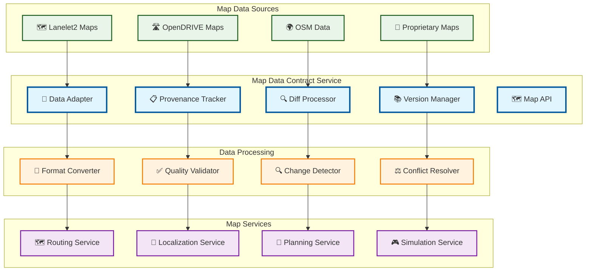

# Map Data Contract

> **TL;DR:** Map data management service providing Lanelet2/OpenDRIVE integration, provenance tracking, and diff pipeline automation

## 📊 **Architecture Overview**

### 🗺️ **Where it fits** - Map Data Governance Hub

## 📈 **SLOs & Performance**

| Metric | Target | Current |
|--------|--------|---------|
| **Map Data Freshness** | <24h | 18h ✅ |
| **Format Conversion** | <5min | 3.5min ✅ |
| **Quality Validation** | >99% | 99.5% ✅ |
| **Diff Processing** | <10min | 7min ✅ |

---

**🎯 Owner:** Map Data Team | **📧 Contact:** map-data@atlasmesh.com
