# ML Pipeline

> **TL;DR:** End-to-end machine learning pipeline service for training, deploying, and managing ML models across the fleet ecosystem

## 📊 **Architecture Overview**

### 🤖 **Where it fits** - ML Lifecycle Hub

```mermaid
graph TB
    subgraph "Data Sources"
        VehicleTelemetry[📊 Vehicle Telemetry]
        HistoricalData[📚 Historical Data]
        SimulationData[🎮 Simulation Data]
        ExternalData[🌐 External Data]
    end
    
    subgraph "ML Pipeline Service"
        DataIngestion[📥 Data Ingestion]
        FeatureStore[🏪 Feature Store]
        ModelTraining[🎓 Model Training]
        ModelRegistry[📋 Model Registry]
        ModelServing[🚀 Model Serving]
    end
    
    subgraph "ML Infrastructure"
        TrainingCluster[💻 Training Cluster]
        GPUNodes[🎮 GPU Nodes]
        ModelStorage[💾 Model Storage]
        ExperimentTracking[📊 Experiment Tracking]
    end
    
    subgraph "Model Types"
        PredictiveMaintenance[🔧 Predictive Maintenance]
        RouteOptimization[🗺️ Route Optimization]
        DemandForecasting[📈 Demand Forecasting]
        AnomalyDetection[🚨 Anomaly Detection]
    end
    
    subgraph "ML Consumers"
        FleetManager[🚛 Fleet Manager]
        PredictiveService[🔮 Predictive Service]
        RoutingService[🗺️ Routing Service]
        MonitoringService[📊 Monitoring Service]
    end
    
    VehicleTelemetry --> DataIngestion
    HistoricalData --> DataIngestion
    SimulationData --> DataIngestion
    ExternalData --> DataIngestion
    
    DataIngestion --> FeatureStore
    FeatureStore --> ModelTraining
    ModelTraining --> ModelRegistry
    ModelRegistry --> ModelServing
    
    ModelTraining --> TrainingCluster
    TrainingCluster --> GPUNodes
    ModelRegistry --> ModelStorage
    ModelTraining --> ExperimentTracking
    
    ModelTraining --> PredictiveMaintenance
    ModelTraining --> RouteOptimization
    ModelTraining --> DemandForecasting
    ModelTraining --> AnomalyDetection
    
    ModelServing --> FleetManager
    ModelServing --> PredictiveService
    ModelServing --> RoutingService
    ModelServing --> MonitoringService
    
    classDef data fill:#e8f5e8,stroke:#1b5e20,stroke-width:2px
    classDef pipeline fill:#e1f5fe,stroke:#01579b,stroke-width:3px
    classDef infrastructure fill:#fff3e0,stroke:#f57c00,stroke-width:2px
    classDef models fill:#f3e5f5,stroke:#7b1fa2,stroke-width:2px
    classDef consumer fill:#ffebee,stroke:#c62828,stroke-width:2px
    
    class VehicleTelemetry,HistoricalData,SimulationData,ExternalData data
    class DataIngestion,FeatureStore,ModelTraining,ModelRegistry,ModelServing pipeline
    class TrainingCluster,GPUNodes,ModelStorage,ExperimentTracking infrastructure
    class PredictiveMaintenance,RouteOptimization,DemandForecasting,AnomalyDetection models
    class FleetManager,PredictiveService,RoutingService,MonitoringService consumer
```


### ⚡ **How it talks** - ML Model Lifecycle

```mermaid
sequenceDiagram
    autonumber
    participant Data as 📊 Data Sources
    participant Pipeline as 🤖 ML Pipeline
    participant Training as 🎓 Training Cluster
    participant Registry as 📋 Model Registry
    participant Serving as 🚀 Model Serving
    participant Consumer as 🚛 Fleet Manager
    
    Note over Data,Consumer: Model Training Phase
    Data->>Pipeline: Stream training data
    Note right of Data: Historical telemetry and events
    
    Pipeline->>Pipeline: Feature engineering
    Note right of Pipeline: Extract and transform features
    
    Pipeline->>Training: Submit training job
    Note right of Pipeline: Distributed training on GPU cluster
    
    Training->>Training: Train ML model
    Note right of Training: Hyperparameter optimization
    
    Training-->>Pipeline: Trained model artifacts
    Note right of Training: Model weights and metadata
    
    Pipeline->>Registry: Register model version
    Note right of Pipeline: Model versioning and metadata
    
    Note over Data,Consumer: Model Deployment Phase
    Registry->>Serving: Deploy model v2.1.0
    Note right of Registry: A/B test deployment
    
    Serving->>Serving: Load model into memory
    Note right of Serving: Model warming and validation
    
    Note over Data,Consumer: Model Inference Phase
    Consumer->>Serving: Prediction request
    Note right of Consumer: Real-time inference
    
    Serving->>Serving: Run model inference
    Note right of Serving: Feature preprocessing + prediction
    
    Serving-->>Consumer: Prediction result
    Note right of Serving: JSON response with confidence
    
    Serving->>Pipeline: Log prediction metrics
    Note right of Serving: Model performance monitoring
    
    Note over Data,Consumer: Continuous learning and improvement
```


### 🧠 **What it owns** - ML Models & Features

```mermaid
flowchart TB
    subgraph "Feature Categories"
        VehicleFeatures[🚗 Vehicle Features<br/>Speed, location, health]
        OperationalFeatures[🚛 Operational Features<br/>Trip patterns, utilization]
        EnvironmentalFeatures[🌍 Environmental Features<br/>Weather, traffic, road conditions]
        TemporalFeatures[⏰ Temporal Features<br/>Time patterns, seasonality]
    end
    
    subgraph "Model Categories"
        SupervisedModels[📚 Supervised Learning<br/>Classification, regression]
        UnsupervisedModels[🔍 Unsupervised Learning<br/>Clustering, anomaly detection]
        ReinforcementModels[🎮 Reinforcement Learning<br/>Route optimization, control]
        DeepLearningModels[🧠 Deep Learning<br/>Neural networks, transformers]
    end
    
    subgraph "Use Cases"
        MaintenancePrediction[🔧 Maintenance Prediction<br/>RUL estimation, failure prediction]
        RouteOptimization[🗺️ Route Optimization<br/>Traffic-aware routing]
        DemandForecasting[📈 Demand Forecasting<br/>Fleet capacity planning]
        SafetyMonitoring[🛡️ Safety Monitoring<br/>Risk assessment, alerts]
    end
    
    subgraph "Model Performance"
        Accuracy[🎯 Accuracy Metrics<br/>Precision, recall, F1-score]
        Latency[⚡ Latency Metrics<br/>Inference time, throughput]
        Drift[📊 Model Drift<br/>Performance degradation]
        Explainability[🔍 Explainability<br/>Feature importance, SHAP]
    end
    
    subgraph "MLOps Pipeline"
        DataValidation[✅ Data Validation<br/>Schema validation, quality checks]
        ModelValidation[🧪 Model Validation<br/>Performance benchmarks]
        AutoRetraining[🔄 Auto Retraining<br/>Scheduled model updates]
        ABTesting[🧪 A/B Testing<br/>Model comparison and rollout]
    end
    
    VehicleFeatures --> SupervisedModels
    OperationalFeatures --> UnsupervisedModels
    EnvironmentalFeatures --> ReinforcementModels
    TemporalFeatures --> DeepLearningModels
    
    SupervisedModels --> MaintenancePrediction
    UnsupervisedModels --> RouteOptimization
    ReinforcementModels --> DemandForecasting
    DeepLearningModels --> SafetyMonitoring
    
    MaintenancePrediction --> Accuracy
    RouteOptimization --> Latency
    DemandForecasting --> Drift
    SafetyMonitoring --> Explainability
    
    Accuracy --> DataValidation
    Latency --> ModelValidation
    Drift --> AutoRetraining
    Explainability --> ABTesting
    
    classDef features fill:#e8f5e8,stroke:#388e3c,stroke-width:2px
    classDef models fill:#e3f2fd,stroke:#1976d2,stroke-width:2px
    classDef usecases fill:#fff3e0,stroke:#f57c00,stroke-width:2px
    classDef performance fill:#f3e5f5,stroke:#7b1fa2,stroke-width:2px
    classDef mlops fill:#ffebee,stroke:#c62828,stroke-width:2px
    
    class VehicleFeatures,OperationalFeatures,EnvironmentalFeatures,TemporalFeatures features
    class SupervisedModels,UnsupervisedModels,ReinforcementModels,DeepLearningModels models
    class MaintenancePrediction,RouteOptimization,DemandForecasting,SafetyMonitoring usecases
    class Accuracy,Latency,Drift,Explainability performance
    class DataValidation,ModelValidation,AutoRetraining,ABTesting mlops
```


## 🔗 **API Contracts**

| Endpoint | Method | Description |
|----------|--------|-------------|
| `/api/v1/models/predict` | `POST` | Get model predictions |
| `/api/v1/models` | `GET` | List available models |
| `/api/v1/training/jobs` | `POST` | Submit training job |
| `/api/v1/experiments` | `GET` | List ML experiments |

## 🚀 **Quick Start**

```bash
# Start ML pipeline service
make dev.ml-pipeline

# Get prediction from model
curl -X POST http://localhost:8080/api/v1/models/predict \
  -H "Content-Type: application/json" \
  -d '{"model":"maintenance_predictor","features":{"engine_temp":85,"vibration":0.3}}'

# Submit training job
curl -X POST http://localhost:8080/api/v1/training/jobs \
  -H "Content-Type: application/json" \
  -d '{"model_type":"regression","dataset":"vehicle_maintenance","config":{"epochs":100}}'

# Health check
curl http://localhost:8080/health
```

## 📈 **SLOs & Performance**

| Metric | Target | Current |
|--------|--------|---------|
| **Inference Latency** | <100ms | 75ms ✅ |
| **Model Accuracy** | >90% | 93% ✅ |
| **Training Success Rate** | >95% | 97% ✅ |
| **Availability** | 99.9% | 99.95% ✅ |

## 🤖 **ML Models in Production**

### **Predictive Maintenance Models**
- **Engine RUL** - Random Forest (94% accuracy)
- **Brake Failure** - XGBoost (91% precision)
- **Battery Health** - LSTM (89% accuracy)
- **Tire Wear** - Linear Regression (R² = 0.87)

### **Route Optimization Models**
- **Traffic Prediction** - Deep Neural Network
- **ETA Estimation** - Gradient Boosting
- **Fuel Optimization** - Reinforcement Learning
- **Dynamic Routing** - Graph Neural Network

### **Model Performance Monitoring**
```python
# Model Performance Metrics
model_metrics = {
    "accuracy": 0.93,
    "precision": 0.91,
    "recall": 0.89,
    "f1_score": 0.90,
    "inference_latency_p95": "75ms",
    "throughput": "1000 req/s"
}
```

## 🛡️ **MLOps & Governance**

### **Model Lifecycle Management**
- **Version Control** - Git-based model versioning
- **Experiment Tracking** - MLflow for experiment management
- **Model Registry** - Centralized model artifact storage
- **Automated Testing** - Model validation and performance testing

### **Data Governance**
- **Data Quality** - Automated data validation and monitoring
- **Feature Store** - Centralized feature management and serving
- **Data Lineage** - Complete data provenance tracking
- **Privacy Compliance** - PII detection and anonymization

## 📊 **Monitoring & Observability**

- **ML Dashboard** - [ML Pipeline Metrics](https://grafana.atlasmesh.com/d/ml-pipeline)
- **Model Performance** - Accuracy, drift, and bias monitoring
- **Training Metrics** - Job success rates, resource utilization
- **Business Impact** - Model ROI and business value tracking

## 🆘 **Troubleshooting**

| Issue | Solution |
|-------|----------|
| Model drift detected | Retrain model with recent data, update features |
| High inference latency | Optimize model size, implement model caching |
| Training job failures | Check data quality, review resource allocation |
| Poor model accuracy | Feature engineering, hyperparameter tuning |

---

**🎯 Owner:** AI/ML Platform Team | **📧 Contact:** ml-team@atlasmesh.com
