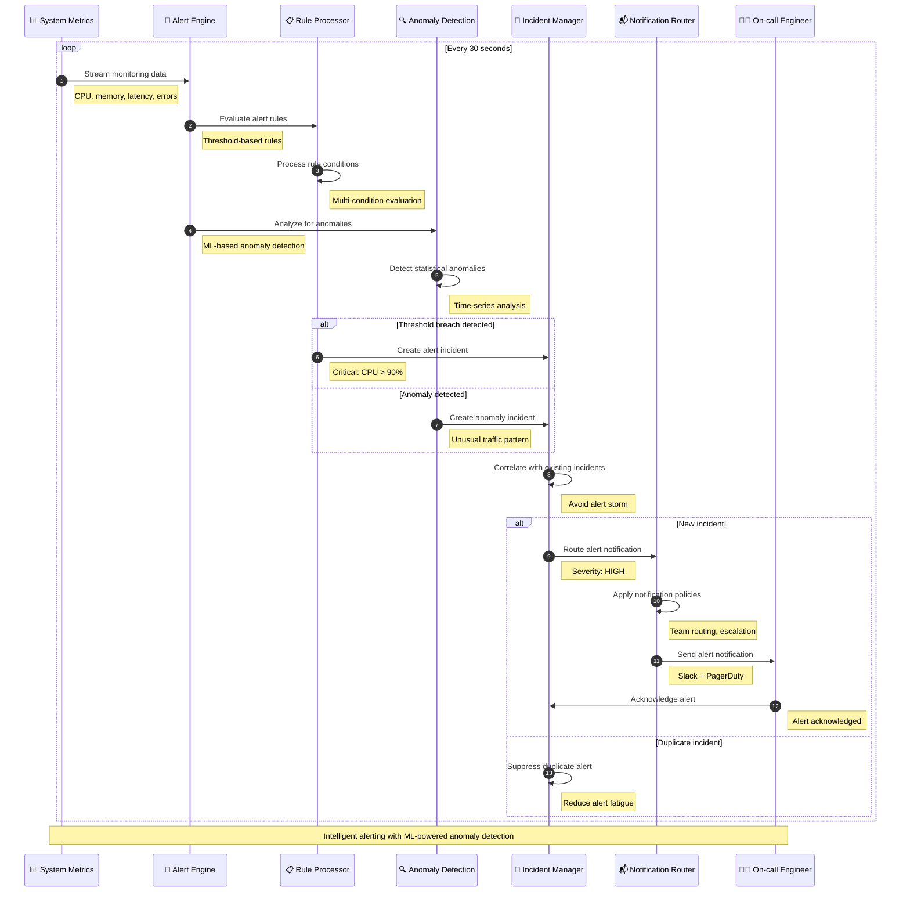
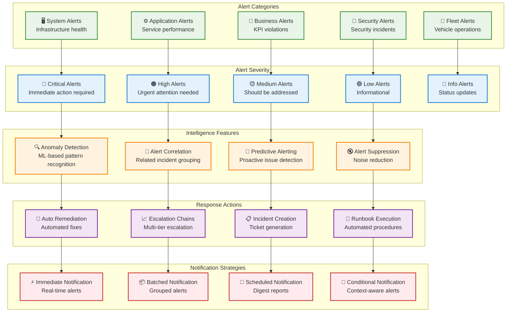

# Monitoring Alerting

> **TL;DR:** Intelligent monitoring and alerting service providing proactive incident detection, smart alerting, and automated response capabilities

## 📊 **Architecture Overview**

### 🚨 **Where it fits** - Alert Intelligence Hub

```mermaid
graph TB
    subgraph "Monitoring Sources"
        SystemMetrics[📊 System Metrics]
        ApplicationLogs[📝 Application Logs]
        BusinessMetrics[💼 Business Metrics]
        SecurityEvents[🔐 Security Events]
        VehicleTelemetry[🚗 Vehicle Telemetry]
    end
    
    subgraph "Monitoring Alerting Service"
        AlertEngine[🚨 Alert Engine]
        RuleProcessor[📋 Rule Processor]
        IncidentManager[🎯 Incident Manager]
        NotificationRouter[📬 Notification Router]
        AlertAPI[🔌 Alert API]
    end
    
    subgraph "Intelligence Layer"
        AnomalyDetection[🔍 Anomaly Detection]
        CorrelationEngine[🔗 Correlation Engine]
        PredictiveAlerting[🔮 Predictive Alerting]
        AlertSuppression[🔇 Alert Suppression]
    end
    
    subgraph "Notification Channels"
        SlackIntegration[💬 Slack Integration]
        EmailNotifications[📧 Email Notifications]
        PagerDutyIntegration[📟 PagerDuty Integration]
        WebhookNotifications[🔗 Webhook Notifications]
        SMSAlerts[📱 SMS Alerts]
    end
    
    subgraph "Response Automation"
        AutoRemediation[🤖 Auto Remediation]
        EscalationPolicies[📈 Escalation Policies]
        IncidentTracking[📋 Incident Tracking]
        PostMortemAnalysis[📊 Post-mortem Analysis]
    end
    
    SystemMetrics --> AlertEngine
    ApplicationLogs --> AlertEngine
    BusinessMetrics --> AlertEngine
    SecurityEvents --> AlertEngine
    VehicleTelemetry --> AlertEngine
    
    AlertEngine --> RuleProcessor
    RuleProcessor --> IncidentManager
    IncidentManager --> NotificationRouter
    NotificationRouter --> AlertAPI
    
    AlertEngine --> AnomalyDetection
    RuleProcessor --> CorrelationEngine
    IncidentManager --> PredictiveAlerting
    NotificationRouter --> AlertSuppression
    
    NotificationRouter --> SlackIntegration
    NotificationRouter --> EmailNotifications
    NotificationRouter --> PagerDutyIntegration
    NotificationRouter --> WebhookNotifications
    NotificationRouter --> SMSAlerts
    
    IncidentManager --> AutoRemediation
    AlertEngine --> EscalationPolicies
    RuleProcessor --> IncidentTracking
    AlertAPI --> PostMortemAnalysis
    
    classDef source fill:#e8f5e8,stroke:#1b5e20,stroke-width:2px
    classDef monitoring fill:#e1f5fe,stroke:#01579b,stroke-width:3px
    classDef intelligence fill:#fff3e0,stroke:#f57c00,stroke-width:2px
    classDef notification fill:#f3e5f5,stroke:#7b1fa2,stroke-width:2px
    classDef response fill:#ffebee,stroke:#c62828,stroke-width:2px
    
    class SystemMetrics,ApplicationLogs,BusinessMetrics,SecurityEvents,VehicleTelemetry source
    class AlertEngine,RuleProcessor,IncidentManager,NotificationRouter,AlertAPI monitoring
    class AnomalyDetection,CorrelationEngine,PredictiveAlerting,AlertSuppression intelligence
    class SlackIntegration,EmailNotifications,PagerDutyIntegration,WebhookNotifications,SMSAlerts notification
    class AutoRemediation,EscalationPolicies,IncidentTracking,PostMortemAnalysis response
```


### ⚡ **How it talks** - Intelligent Alert Processing


### 🔔 **What it owns** - Alert Rules & Intelligence


## 🔗 **API Contracts**

| Endpoint | Method | Description |
|----------|--------|-------------|
| `/api/v1/alerts` | `GET` | List active alerts |
| `/api/v1/alerts/{id}/acknowledge` | `POST` | Acknowledge alert |
| `/api/v1/rules` | `GET` | List alert rules |
| `/api/v1/incidents` | `GET` | List incidents |

## 🚀 **Quick Start**

```bash
# Start monitoring alerting service
make dev.monitoring-alerting

# Get active alerts
curl http://localhost:8080/api/v1/alerts?status=active

# Acknowledge an alert
curl -X POST http://localhost:8080/api/v1/alerts/alert-12345/acknowledge \
  -H "Content-Type: application/json" \
  -d '{"acknowledged_by":"engineer@atlasmesh.com","note":"Investigating issue"}'

# Health check
curl http://localhost:8080/health
```

## 📈 **SLOs & Performance**

| Metric | Target | Current |
|--------|--------|---------|
| **Alert Processing Time** | <30s | 22s ✅ |
| **False Positive Rate** | <5% | 3.2% ✅ |
| **Notification Delivery** | <60s | 45s ✅ |
| **Availability** | 99.99% | 99.995% ✅ |

## 🚨 **Alert Management Features**

### **Smart Alerting**
```yaml
# Alert Rule Configuration
alert_rules:
  high_cpu_usage:
    condition: "cpu_usage > 90%"
    duration: "5m"
    severity: "critical"
    auto_remediation: "scale_up"
    
  anomaly_detection:
    algorithm: "isolation_forest"
    sensitivity: "medium"
    baseline_period: "7d"
    
  correlation_rules:
    - group_by: ["service", "environment"]
    - time_window: "10m"
    - max_alerts_per_group: 3
```

### **Notification Channels**
- **Slack Integration** - Team channels with rich formatting
- **PagerDuty Integration** - On-call escalation and scheduling
- **Email Notifications** - Digest reports and critical alerts
- **Webhook Notifications** - Custom integrations and automation
- **SMS Alerts** - Critical alerts for immediate attention

### **Auto-Remediation**
- **Service Restart** - Automatic service recovery
- **Scaling Actions** - Auto-scaling based on load
- **Circuit Breaker** - Automatic traffic redirection
- **Cache Clearing** - Performance optimization actions

## 🛡️ **Alert Intelligence**

### **Anomaly Detection**
- **Statistical Models** - Time-series anomaly detection
- **Machine Learning** - Pattern recognition and prediction
- **Behavioral Analysis** - User and system behavior monitoring
- **Seasonal Patterns** - Time-based pattern recognition

### **Alert Correlation**
- **Temporal Correlation** - Time-based event grouping
- **Spatial Correlation** - Service and infrastructure grouping
- **Causal Correlation** - Root cause analysis
- **Symptom Correlation** - Related symptom identification

## 📊 **Monitoring & Analytics**

- **Alert Dashboard** - [Monitoring & Alerting Analytics](https://grafana.atlasmesh.com/d/monitoring-alerting)
- **Alert Effectiveness** - False positive rates, response times
- **Incident Analytics** - MTTR, MTBF, incident patterns
- **Team Performance** - Response times, resolution rates

## 🆘 **Troubleshooting**

| Issue | Solution |
|-------|----------|
| High false positive rate | Tune alert thresholds, improve anomaly detection models |
| Alert fatigue | Implement alert suppression, improve correlation rules |
| Delayed notifications | Check notification channel health, optimize routing |
| Missing critical alerts | Review alert coverage, validate monitoring data sources |

---

**🎯 Owner:** SRE Platform Team | **📧 Contact:** sre-platform@atlasmesh.com
