# Observability

> **TL;DR:** Unified observability platform providing metrics, logs, traces, and alerting for the entire AtlasMesh Fleet OS ecosystem

## 📊 **Architecture Overview**

### 👁️ **Where it fits** - Observability Hub


### ⚡ **How it talks** - Three Pillars of Observability

```mermaid
sequenceDiagram
    autonumber
    participant Service as 🚛 Fleet Manager
    participant Metrics as 📈 Metrics Collector
    participant Logs as 📝 Log Aggregator
    participant Traces as 🔍 Trace Collector
    participant Prometheus as 📊 Prometheus
    participant ES as 🔍 Elasticsearch
    participant Jaeger as 🔗 Jaeger
    participant Alert as 🚨 Alert Manager
    
    Note over Service,Alert: Metrics Collection
    Service->>Metrics: Expose /metrics endpoint
    Note right of Service: Prometheus format metrics
    
    Metrics->>Prometheus: Scrape metrics every 15s
    Note right of Metrics: Time-series data storage
    
    Note over Service,Alert: Log Collection
    Service->>Logs: Structured JSON logs
    Note right of Service: Application and access logs
    
    Logs->>ES: Index log entries
    Note right of Logs: Full-text search capability
    
    Note over Service,Alert: Distributed Tracing
    Service->>Traces: OpenTelemetry spans
    Note right of Service: Request correlation IDs
    
    Traces->>Jaeger: Store trace data
    Note right of Traces: End-to-end request tracking
    
    Note over Service,Alert: Alerting Pipeline
    Prometheus->>Alert: Evaluate alert rules
    Note right of Prometheus: SLO breach detection
    
    Alert->>Alert: Process alert conditions
    Note right of Alert: Alert routing and grouping
    
    Alert->>Alert: Send notifications
    Note right of Alert: Slack, email, PagerDuty
    
    Note over Service,Alert: Unified observability with correlation
```


### 📊 **What it owns** - Observability Data & SLOs

```mermaid
flowchart TB
    subgraph "Metrics Categories"
        BusinessMetrics[📊 Business Metrics<br/>Fleet utilization, trip success]
        ApplicationMetrics[⚙️ Application Metrics<br/>Request rate, latency, errors]
        InfraMetrics[🏗️ Infrastructure Metrics<br/>CPU, memory, disk, network]
        CustomMetrics[🎯 Custom Metrics<br/>Domain-specific KPIs]
    end
    
    subgraph "Log Categories"
        ApplicationLogs[📝 Application Logs<br/>Service events, errors]
        AccessLogs[🌐 Access Logs<br/>API requests, responses]
        AuditLogs[📋 Audit Logs<br/>Security events, compliance]
        SystemLogs[🖥️ System Logs<br/>OS events, container logs]
    end
    
    subgraph "Trace Categories"
        RequestTraces[🔗 Request Traces<br/>End-to-end request flow]
        ServiceTraces[⚙️ Service Traces<br/>Inter-service communication]
        DatabaseTraces[🗄️ Database Traces<br/>Query performance]
        ExternalTraces[🌐 External Traces<br/>Third-party API calls]
    end
    
    subgraph "SLO Definitions"
        AvailabilitySLO[✅ Availability SLO<br/>99.9% uptime target]
        LatencySLO[⚡ Latency SLO<br/>P95 < 200ms target]
        ErrorRateSLO[❌ Error Rate SLO<br/><0.1% error target]
        ThroughputSLO[📈 Throughput SLO<br/>1000 req/s capacity]
    end
    
    subgraph "Alert Channels"
        SlackAlerts[💬 Slack Alerts<br/>Team notifications]
        EmailAlerts[📧 Email Alerts<br/>Management reports]
        PagerDutyAlerts[📟 PagerDuty Alerts<br/>On-call escalation]
        WebhookAlerts[🔗 Webhook Alerts<br/>Automated responses]
    end
    
    BusinessMetrics --> AvailabilitySLO
    ApplicationMetrics --> LatencySLO
    InfraMetrics --> ErrorRateSLO
    CustomMetrics --> ThroughputSLO
    
    ApplicationLogs --> RequestTraces
    AccessLogs --> ServiceTraces
    AuditLogs --> DatabaseTraces
    SystemLogs --> ExternalTraces
    
    AvailabilitySLO --> SlackAlerts
    LatencySLO --> EmailAlerts
    ErrorRateSLO --> PagerDutyAlerts
    ThroughputSLO --> WebhookAlerts
    
    classDef metrics fill:#e3f2fd,stroke:#1976d2,stroke-width:2px
    classDef logs fill:#e8f5e8,stroke:#388e3c,stroke-width:2px
    classDef traces fill:#fff3e0,stroke:#f57c00,stroke-width:2px
    classDef slo fill:#f3e5f5,stroke:#7b1fa2,stroke-width:2px
    classDef alerts fill:#ffebee,stroke:#c62828,stroke-width:2px
    
    class BusinessMetrics,ApplicationMetrics,InfraMetrics,CustomMetrics metrics
    class ApplicationLogs,AccessLogs,AuditLogs,SystemLogs logs
    class RequestTraces,ServiceTraces,DatabaseTraces,ExternalTraces traces
    class AvailabilitySLO,LatencySLO,ErrorRateSLO,ThroughputSLO slo
    class SlackAlerts,EmailAlerts,PagerDutyAlerts,WebhookAlerts alerts
```


## 🔗 **API Contracts**

| Endpoint | Method | Description |
|----------|--------|-------------|
| `/api/v1/metrics/query` | `GET` | Query metrics data |
| `/api/v1/logs/search` | `GET` | Search log entries |
| `/api/v1/traces/{id}` | `GET` | Get trace details |
| `/api/v1/alerts/rules` | `GET` | List alert rules |

## 🚀 **Quick Start**

```bash
# Start observability stack
make dev.observability

# Query fleet availability metrics
curl "http://localhost:8080/api/v1/metrics/query?query=fleet_availability_ratio"

# Search for error logs
curl "http://localhost:8080/api/v1/logs/search?q=level:ERROR&from=1h"

# Health check
curl http://localhost:8080/health
```

## 📈 **SLOs & Performance**

| Metric | Target | Current |
|--------|--------|---------|
| **Metrics Ingestion** | 1M points/s | 850K points/s ✅ |
| **Log Processing** | 100K logs/s | 85K logs/s ✅ |
| **Query Latency** | <500ms | 350ms ✅ |
| **Data Retention** | 30 days | 30 days ✅ |

## 👁️ **Observability Stack**

### **Three Pillars Implementation**
- **Metrics** - Prometheus + Grafana for time-series data
- **Logs** - Elasticsearch + Kibana for structured logging
- **Traces** - Jaeger for distributed tracing
- **Correlation** - Unified correlation IDs across all pillars

### **SLO Monitoring**
```yaml
# Example SLO Configuration
slos:
  fleet_availability:
    target: 99.9%
    window: 30d
    alert_threshold: 99.5%
  
  api_latency:
    target: 200ms
    percentile: 95
    window: 5m
```

## 🛡️ **Alerting & Incident Response**

- **Smart Alerting** - Context-aware alerts with runbook links
- **Alert Routing** - Team-based routing with escalation policies
- **Incident Management** - Automated incident creation and tracking
- **Post-mortem Analysis** - Automated data collection for RCA

## 📊 **Dashboards & Visualization**

- **Executive Dashboard** - [Fleet KPIs](https://grafana.atlasmesh.com/d/executive)
- **SRE Dashboard** - [System Health](https://grafana.atlasmesh.com/d/sre)
- **Developer Dashboard** - [Service Metrics](https://grafana.atlasmesh.com/d/dev)
- **Business Dashboard** - [Operational Metrics](https://grafana.atlasmesh.com/d/business)

## 🆘 **Troubleshooting**

| Issue | Solution |
|-------|----------|
| High metrics cardinality | Review metric labels, implement sampling |
| Log storage growth | Optimize retention policies, implement log sampling |
| Slow trace queries | Check Jaeger performance, optimize trace sampling |
| Alert fatigue | Tune alert thresholds, implement alert grouping |

---

**🎯 Owner:** SRE Platform Team | **📧 Contact:** sre-team@atlasmesh.com
