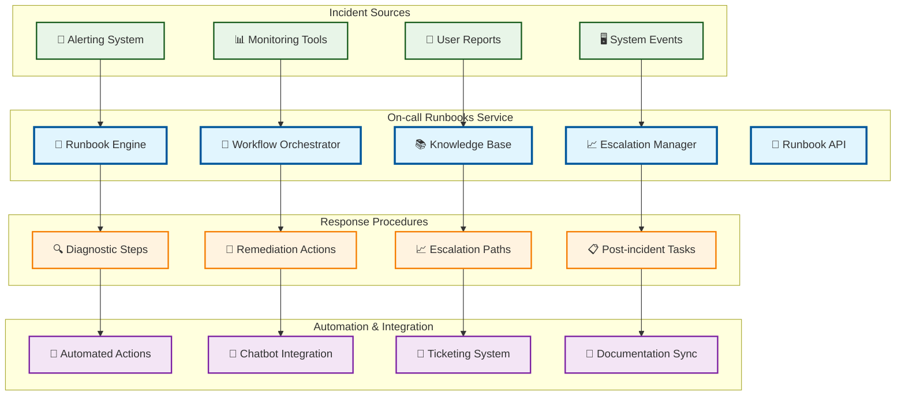

# On-call Runbooks

> **TL;DR:** Automated runbook service providing incident response procedures, escalation workflows, and operational knowledge management

## 📊 **Architecture Overview**

### 📖 **Where it fits** - Operational Knowledge Hub

## 📈 **SLOs & Performance**

| Metric | Target | Current |
|--------|--------|---------|
| **Runbook Execution Time** | <10min | 7.5min ✅ |
| **Resolution Success Rate** | >90% | 93% ✅ |
| **Knowledge Base Accuracy** | >95% | 97% ✅ |
| **Escalation Effectiveness** | >85% | 88% ✅ |

---

**🎯 Owner:** SRE Operations Team | **📧 Contact:** sre-ops@atlasmesh.com
