# On-call Runbooks

> **TL;DR:** Automated runbook service providing incident response procedures, escalation workflows, and operational knowledge management

## 📊 **Architecture Overview**

### 📖 **Where it fits** - Operational Knowledge Hub

```mermaid
graph TB
    subgraph "Incident Sources"
        AlertingSystem[🚨 Alerting System]
        MonitoringTools[📊 Monitoring Tools]
        UserReports[👤 User Reports]
        SystemEvents[🖥️ System Events]
    end
    
    subgraph "On-call Runbooks Service"
        RunbookEngine[📖 Runbook Engine]
        WorkflowOrchestrator[🔄 Workflow Orchestrator]
        KnowledgeBase[📚 Knowledge Base]
        EscalationManager[📈 Escalation Manager]
        RunbookAPI[🔌 Runbook API]
    end
    
    subgraph "Response Procedures"
        DiagnosticSteps[🔍 Diagnostic Steps]
        RemediationActions[🔧 Remediation Actions]
        EscalationPaths[📈 Escalation Paths]
        PostIncidentTasks[📋 Post-incident Tasks]
    end
    
    subgraph "Automation & Integration"
        AutomatedActions[🤖 Automated Actions]
        ChatbotIntegration[💬 Chatbot Integration]
        TicketingSystem[🎫 Ticketing System]
        DocumentationSync[📄 Documentation Sync]
    end
    
    AlertingSystem --> RunbookEngine
    MonitoringTools --> WorkflowOrchestrator
    UserReports --> KnowledgeBase
    SystemEvents --> EscalationManager
    
    RunbookEngine --> DiagnosticSteps
    WorkflowOrchestrator --> RemediationActions
    KnowledgeBase --> EscalationPaths
    EscalationManager --> PostIncidentTasks
    
    DiagnosticSteps --> AutomatedActions
    RemediationActions --> ChatbotIntegration
    EscalationPaths --> TicketingSystem
    PostIncidentTasks --> DocumentationSync
    
    classDef source fill:#e8f5e8,stroke:#1b5e20,stroke-width:2px
    classDef runbook fill:#e1f5fe,stroke:#01579b,stroke-width:3px
    classDef procedure fill:#fff3e0,stroke:#f57c00,stroke-width:2px
    classDef automation fill:#f3e5f5,stroke:#7b1fa2,stroke-width:2px
    
    class AlertingSystem,MonitoringTools,UserReports,SystemEvents source
    class RunbookEngine,WorkflowOrchestrator,KnowledgeBase,EscalationManager,RunbookAPI runbook
    class DiagnosticSteps,RemediationActions,EscalationPaths,PostIncidentTasks procedure
    class AutomatedActions,ChatbotIntegration,TicketingSystem,DocumentationSync automation
```

## 📈 **SLOs & Performance**

| Metric | Target | Current |
|--------|--------|---------|
| **Runbook Execution Time** | <10min | 7.5min ✅ |
| **Resolution Success Rate** | >90% | 93% ✅ |
| **Knowledge Base Accuracy** | >95% | 97% ✅ |
| **Escalation Effectiveness** | >85% | 88% ✅ |

---

**🎯 Owner:** SRE Operations Team | **📧 Contact:** sre-ops@atlasmesh.com
