# Policy Engine

> **TL;DR:** Policy-as-code evaluation engine using OPA/Rego for real-time decision making and compliance enforcement

## 📊 **Architecture Overview**

### ⚖️ **Where it fits** - Decision Engine

```mermaid
graph TB
    subgraph "Policy Sources"
        SafetyPolicies[🛡️ Safety Policies]
        BusinessRules[📋 Business Rules]
        ComplianceReqs[📜 Compliance Requirements]
        UAERegulations[🇦🇪 UAE AV Regulations]
    end
    
    subgraph "Policy Engine"
        OPARuntime[⚖️ OPA Runtime]
        PolicyStore[📚 Policy Store]
        DecisionCache[⚡ Decision Cache]
        PolicyAPI[🔌 Policy API]
    end
    
    subgraph "Decision Points"
        AuthDecisions[🔐 Auth Decisions]
        FleetOperations[🚛 Fleet Operations]
        VehicleCommands[🚗 Vehicle Commands]
        SafetyOverrides[🚨 Safety Overrides]
    end
    
    subgraph "Requesting Services"
        AuthService[🔐 Auth Service]
        FleetManager[🚛 Fleet Manager]
        VehicleGateway[🌐 Vehicle Gateway]
        ControlCenter[🖥️ Control Center]
    end
    
    subgraph "Audit & Compliance"
        DecisionLogs[📝 Decision Logs]
        AuditTrail[🔍 Audit Trail]
        ComplianceReports[📊 Compliance Reports]
    end
    
    SafetyPolicies --> PolicyStore
    BusinessRules --> PolicyStore
    ComplianceReqs --> PolicyStore
    UAERegulations --> PolicyStore
    
    PolicyStore --> OPARuntime
    OPARuntime --> DecisionCache
    OPARuntime --> PolicyAPI
    
    PolicyAPI --> AuthDecisions
    PolicyAPI --> FleetOperations
    PolicyAPI --> VehicleCommands
    PolicyAPI --> SafetyOverrides
    
    AuthService --> PolicyAPI
    FleetManager --> PolicyAPI
    VehicleGateway --> PolicyAPI
    ControlCenter --> PolicyAPI
    
    OPARuntime --> DecisionLogs
    DecisionLogs --> AuditTrail
    AuditTrail --> ComplianceReports
    
    classDef policy fill:#e1f5fe,stroke:#01579b,stroke-width:3px
    classDef source fill:#f3e5f5,stroke:#7b1fa2,stroke-width:2px
    classDef decision fill:#e8f5e8,stroke:#388e3c,stroke-width:2px
    classDef service fill:#fff3e0,stroke:#f57c00,stroke-width:2px
    classDef audit fill:#ffebee,stroke:#c62828,stroke-width:2px
    
    class OPARuntime,PolicyStore,DecisionCache,PolicyAPI policy
    class SafetyPolicies,BusinessRules,ComplianceReqs,UAERegulations source
    class AuthDecisions,FleetOperations,VehicleCommands,SafetyOverrides decision
    class AuthService,FleetManager,VehicleGateway,ControlCenter service
    class DecisionLogs,AuditTrail,ComplianceReports audit
```


### ⚡ **How it talks** - Policy Evaluation Flow

```mermaid
sequenceDiagram
    autonumber
    participant Service as 🚛 Fleet Manager
    participant API as ⚖️ Policy Engine API
    participant OPA as 🧠 OPA Runtime
    participant Cache as ⚡ Decision Cache
    participant Audit as 📝 Audit Logger
    
    Service->>API: POST /v1/policy/evaluate
    Note right of Service: Request: user, resource, action, context
    
    API->>Cache: Check cached decision
    Note right of API: Cache key: hash(input)
    
    alt Cache hit
        Cache-->>API: Cached decision
        Note right of Cache: <1ms cache lookup
    else Cache miss
        API->>OPA: Evaluate policy bundle
        Note right of API: Rego policy execution
        
        OPA->>OPA: Load safety policies
        Note right of OPA: UAE AV safety rules
        
        OPA->>OPA: Evaluate business rules
        Note right of OPA: Fleet operation constraints
        
        OPA->>OPA: Check compliance requirements
        Note right of OPA: Regulatory compliance
        
        OPA-->>API: Decision + reasoning
        Note right of OPA: allow/deny + explanation
        
        API->>Cache: Store decision (TTL: 5min)
        Note right of API: Cache for future requests
    end
    
    API->>Audit: Log decision event
    Note right of API: Compliance audit trail
    
    API-->>Service: Policy decision
    Note right of API: JSON response with decision
    
    Service->>Service: Enforce decision
    Note right of Service: Allow/deny requested action
    
    Note over Service,Audit: <10ms policy evaluation latency
```


### 📋 **What it owns** - Policy Rules & Decisions

```mermaid
flowchart TB
    subgraph "Policy Categories"
        SafetyPol[🛡️ Safety Policies]
        BusinessPol[📊 Business Policies]
        CompliancePol[📜 Compliance Policies]
        SecurityPol[🔐 Security Policies]
    end
    
    subgraph "Safety Rules"
        EmergencyAuth[🚨 Emergency Authorization]
        VehicleHealth[🔧 Vehicle Health Checks]
        WeatherLimits[🌧️ Weather Restrictions]
        OperatorCert[👤 Operator Certification]
    end
    
    subgraph "Business Rules"
        FleetCapacity[🚛 Fleet Capacity Limits]
        ServiceHours[🕒 Operating Hours]
        RouteRestrictions[🗺️ Route Restrictions]
        CostOptimization[💰 Cost Controls]
    end
    
    subgraph "Compliance Rules"
        UAERegulations[🇦🇪 UAE AV Laws]
        DataPrivacy[🔒 GDPR/Privacy Laws]
        SafetyStandards[📋 ISO 26262]
        AuditRequirements[📊 Audit Standards]
    end
    
    subgraph "Decision Types"
        Allow[✅ Allow]
        Deny[❌ Deny]
        Conditional[⚠️ Allow with Conditions]
        Escalate[📞 Require Approval]
    end
    
    subgraph "Decision Context"
        UserContext[👤 User Profile]
        VehicleContext[🚗 Vehicle State]
        EnvironmentContext[🌍 Environment]
        TimeContext[🕒 Temporal Factors]
    end
    
    SafetyPol --> EmergencyAuth
    SafetyPol --> VehicleHealth
    SafetyPol --> WeatherLimits
    SafetyPol --> OperatorCert
    
    BusinessPol --> FleetCapacity
    BusinessPol --> ServiceHours
    BusinessPol --> RouteRestrictions
    BusinessPol --> CostOptimization
    
    CompliancePol --> UAERegulations
    CompliancePol --> DataPrivacy
    CompliancePol --> SafetyStandards
    CompliancePol --> AuditRequirements
    
    EmergencyAuth --> Allow
    VehicleHealth --> Deny
    WeatherLimits --> Conditional
    OperatorCert --> Escalate
    
    UserContext --> EmergencyAuth
    VehicleContext --> VehicleHealth
    EnvironmentContext --> WeatherLimits
    TimeContext --> ServiceHours
    
    classDef policy fill:#e3f2fd,stroke:#1976d2,stroke-width:2px
    classDef safety fill:#ffebee,stroke:#c62828,stroke-width:2px
    classDef business fill:#e8f5e8,stroke:#388e3c,stroke-width:2px
    classDef compliance fill:#fff3e0,stroke:#f57c00,stroke-width:2px
    classDef decision fill:#f3e5f5,stroke:#7b1fa2,stroke-width:2px
    classDef context fill:#fce4ec,stroke:#ad1457,stroke-width:2px
    
    class SafetyPol,BusinessPol,CompliancePol,SecurityPol policy
    class EmergencyAuth,VehicleHealth,WeatherLimits,OperatorCert safety
    class FleetCapacity,ServiceHours,RouteRestrictions,CostOptimization business
    class UAERegulations,DataPrivacy,SafetyStandards,AuditRequirements compliance
    class Allow,Deny,Conditional,Escalate decision
    class UserContext,VehicleContext,EnvironmentContext,TimeContext context
```


## 🔗 **API Contracts**

| Endpoint | Method | Description |
|----------|--------|-------------|
| `/v1/policy/evaluate` | `POST` | Evaluate policy decision |
| `/v1/policies` | `GET` | List active policies |
| `/v1/policies/{id}` | `PUT` | Update policy |
| `/v1/decisions/audit` | `GET` | Query decision audit logs |

## 🚀 **Quick Start**

### **Development**
```bash
# Start service locally
make dev.policy-engine

# Test policy evaluation
curl -X POST http://localhost:8080/v1/policy/evaluate \
  -H "Content-Type: application/json" \
  -d '{
    "input": {
      "user": {"id": "op001", "roles": ["fleet_operator"]},
      "resource": "vehicle:AV-001",
      "action": "emergency_stop"
    }
  }'

# Health check
curl http://localhost:8080/health
```

### **Policy Development**
```rego
# Example Safety Policy (Rego)
package atlasmesh.safety

# Emergency stop is always allowed for safety operators
allow {
    input.action == "emergency_stop"
    input.user.roles[_] == "safety_operator"
}

# Vehicle commands require healthy vehicle
allow {
    input.action == "vehicle_command"
    input.resource.health_score >= 70
    input.user.roles[_] == "fleet_operator"
}
```

## 📈 **SLOs & Performance**

| Metric | Target | Current |
|--------|--------|---------|
| **P95 Latency** | 10ms | 7ms ✅ |
| **Availability** | 99.99% | 99.995% ✅ |
| **Cache Hit Rate** | >90% | 94% ✅ |
| **Throughput** | 10K req/s | 8.5K req/s ✅ |

## 📋 **Policy Categories**

### **Safety Policies**
- **Emergency Authorization** - Who can trigger emergency stops
- **Vehicle Health Checks** - Minimum health scores for operations
- **Weather Restrictions** - Operating conditions and limitations
- **Operator Certification** - Required certifications and training

### **Business Policies**
- **Fleet Capacity** - Maximum vehicles per operator
- **Service Hours** - Operating time windows
- **Route Restrictions** - Geographical and temporal constraints
- **Cost Controls** - Budget and resource limits

### **Compliance Policies**
- **UAE AV Regulations** - Local autonomous vehicle laws
- **Data Privacy** - GDPR and privacy requirements
- **Safety Standards** - ISO 26262 functional safety
- **Audit Requirements** - Regulatory reporting standards

## 🛡️ **Security & Compliance**

- **Policy Integrity** - Cryptographically signed policy bundles
- **Decision Audit** - Complete audit trail for all decisions
- **Access Control** - RBAC for policy management
- **Compliance Reporting** - Automated regulatory reports

## 📊 **Monitoring & Observability**

- **Policy Dashboard** - [Policy Engine Metrics](https://grafana.atlasmesh.com/d/policy-engine)
- **Decision Analytics** - Policy effectiveness and usage patterns
- **Audit Logs** - `kubectl logs -f deployment/policy-engine -n fleet-os | grep "decision"`

## 🆘 **Troubleshooting**

| Issue | Solution |
|-------|----------|
| High policy latency | Check OPA bundle size, optimize Rego rules |
| Cache misses | Review cache TTL settings, check input variability |
| Policy conflicts | Use policy testing framework, review rule precedence |
| Audit log gaps | Verify audit logger connectivity, check disk space |

---

**🎯 Owner:** Platform Architecture Team | **📧 Contact:** platform-team@atlasmesh.com
