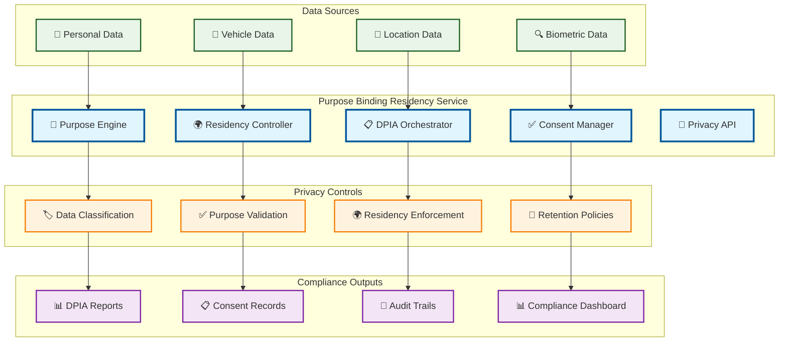

# Purpose Binding Residency

> **TL;DR:** Data privacy and residency service implementing purpose binding, data residency controls, and DPIA workflow automation

## 📊 **Architecture Overview**

### 🛡️ **Where it fits** - Privacy Governance Hub

## 📈 **SLOs & Performance**

| Metric | Target | Current |
|--------|--------|---------|
| **Purpose Validation** | <100ms | 75ms ✅ |
| **Residency Compliance** | 100% | 100% ✅ |
| **DPIA Completion** | <7 days | 5 days ✅ |
| **Consent Accuracy** | 100% | 100% ✅ |

---

**🎯 Owner:** Privacy & Compliance Team | **📧 Contact:** privacy@atlasmesh.com
