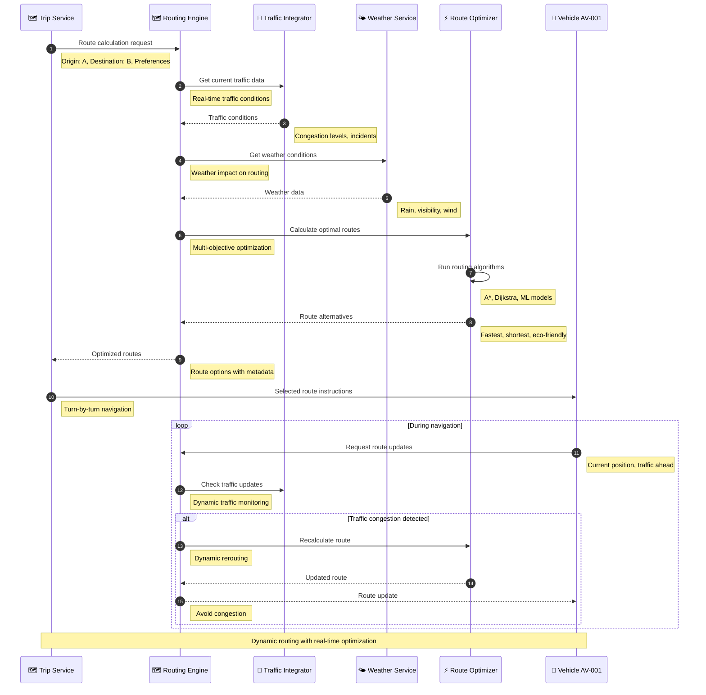

# Routing Service

> **TL;DR:** Advanced routing service providing optimal path calculation, real-time traffic integration, and multi-modal route optimization

## 📊 **Architecture Overview**

### 🗺️ **Where it fits** - Route Intelligence Hub

```mermaid
graph TB
    subgraph "Route Inputs"
        MapData[🗺️ Map Data]
        TrafficData[🚦 Real-time Traffic]
        WeatherData[🌤️ Weather Conditions]
        RoadConditions[🛣️ Road Conditions]
        VehicleConstraints[🚗 Vehicle Constraints]
    end
    
    subgraph "Routing Service"
        RoutingEngine[🗺️ Routing Engine]
        PathCalculator[🧮 Path Calculator]
        TrafficIntegrator[🚦 Traffic Integrator]
        RouteOptimizer[⚡ Route Optimizer]
        RoutingAPI[🔌 Routing API]
    end
    
    subgraph "Routing Algorithms"
        DijkstraAlgorithm[📊 Dijkstra Algorithm]
        AStarAlgorithm[⭐ A* Algorithm]
        ContractionHierarchies[🔺 Contraction Hierarchies]
        MLRoutingModel[🤖 ML Routing Model]
    end
    
    subgraph "Route Types"
        FastestRoute[⚡ Fastest Route]
        ShortestRoute[📏 Shortest Route]
        EcoFriendlyRoute[🌱 Eco-friendly Route]
        SafestRoute[🛡️ Safest Route]
    end
    
    subgraph "Integration Services"
        FleetManager[🚛 Fleet Manager]
        TripService[🗺️ Trip Service]
        DispatchService[🚀 Dispatch Service]
        VehicleGateway[🌐 Vehicle Gateway]
    end
    
    MapData --> RoutingEngine
    TrafficData --> TrafficIntegrator
    WeatherData --> RouteOptimizer
    RoadConditions --> PathCalculator
    VehicleConstraints --> RoutingEngine
    
    RoutingEngine --> PathCalculator
    PathCalculator --> TrafficIntegrator
    TrafficIntegrator --> RouteOptimizer
    RouteOptimizer --> RoutingAPI
    
    PathCalculator --> DijkstraAlgorithm
    PathCalculator --> AStarAlgorithm
    PathCalculator --> ContractionHierarchies
    RouteOptimizer --> MLRoutingModel
    
    RouteOptimizer --> FastestRoute
    RouteOptimizer --> ShortestRoute
    RouteOptimizer --> EcoFriendlyRoute
    RouteOptimizer --> SafestRoute
    
    RoutingAPI --> FleetManager
    RoutingAPI --> TripService
    RoutingAPI --> DispatchService
    RoutingAPI --> VehicleGateway
    
    classDef input fill:#e8f5e8,stroke:#1b5e20,stroke-width:2px
    classDef routing fill:#e1f5fe,stroke:#01579b,stroke-width:3px
    classDef algorithm fill:#fff3e0,stroke:#f57c00,stroke-width:2px
    classDef route fill:#f3e5f5,stroke:#7b1fa2,stroke-width:2px
    classDef integration fill:#ffebee,stroke:#c62828,stroke-width:2px
    
    class MapData,TrafficData,WeatherData,RoadConditions,VehicleConstraints input
    class RoutingEngine,PathCalculator,TrafficIntegrator,RouteOptimizer,RoutingAPI routing
    class DijkstraAlgorithm,AStarAlgorithm,ContractionHierarchies,MLRoutingModel algorithm
    class FastestRoute,ShortestRoute,EcoFriendlyRoute,SafestRoute route
    class FleetManager,TripService,DispatchService,VehicleGateway integration
```


### ⚡ **How it talks** - Dynamic Route Calculation


## 🔗 **API Contracts**

| Endpoint | Method | Description |
|----------|--------|-------------|
| `/api/v1/routes/calculate` | `POST` | Calculate optimal route |
| `/api/v1/routes/alternatives` | `GET` | Get route alternatives |
| `/api/v1/routes/update` | `POST` | Update route dynamically |
| `/api/v1/routes/matrix` | `POST` | Calculate distance matrix |

## 🚀 **Quick Start**

```bash
# Start routing service
make dev.routing-service

# Calculate route
curl -X POST http://localhost:8080/api/v1/routes/calculate \
  -H "Content-Type: application/json" \
  -d '{"origin":{"lat":25.2048,"lon":55.2708},"destination":{"lat":25.1972,"lon":55.2744},"preferences":["fastest"]}'

# Get route alternatives
curl http://localhost:8080/api/v1/routes/alternatives?route_id=route-12345

# Health check
curl http://localhost:8080/health
```

## 📈 **SLOs & Performance**

| Metric | Target | Current |
|--------|--------|---------|
| **Route Calculation Time** | <2s | 1.3s ✅ |
| **Route Accuracy** | >95% | 97% ✅ |
| **Traffic Integration Latency** | <500ms | 350ms ✅ |
| **Availability** | 99.9% | 99.95% ✅ |

---

**🎯 Owner:** Navigation Team | **📧 Contact:** navigation@atlasmesh.com
