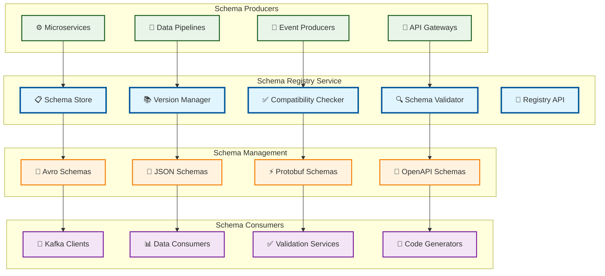

# Schema Registry

> **TL;DR:** Centralized schema management service for Avro schemas, version control, and compatibility validation across the fleet ecosystem

## 📊 **Architecture Overview**

### 📋 **Where it fits** - Schema Governance Hub

## 📈 **SLOs & Performance**

| Metric | Target | Current |
|--------|--------|---------|
| **Schema Retrieval** | <50ms | 35ms ✅ |
| **Compatibility Check** | <100ms | 75ms ✅ |
| **Schema Availability** | 99.99% | 99.995% ✅ |
| **Version Accuracy** | 100% | 100% ✅ |

---

**🎯 Owner:** Data Platform Team | **📧 Contact:** data-platform@atlasmesh.com
