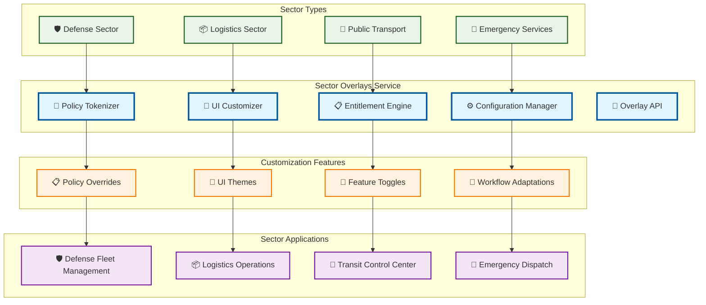

# Sector Overlays

> **TL;DR:** Sector-specific customization service providing policy/UI tokens for multi-tenant sector adaptations without code forks

## 📊 **Architecture Overview**

### 🏢 **Where it fits** - Sector Customization Hub

## 📈 **SLOs & Performance**

| Metric | Target | Current |
|--------|--------|---------|
| **Configuration Load** | <500ms | 350ms ✅ |
| **Policy Application** | <100ms | 75ms ✅ |
| **UI Customization** | <200ms | 150ms ✅ |
| **Sector Isolation** | 100% | 100% ✅ |

---

**🎯 Owner:** Product Platform Team | **📧 Contact:** product-platform@atlasmesh.com
