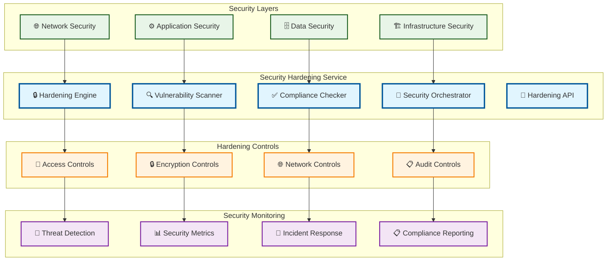

# Security Hardening

> **TL;DR:** Comprehensive security hardening service implementing defense-in-depth strategies and continuous security posture management

## 📊 **Architecture Overview**

### 🔒 **Where it fits** - Security Fortification Hub

## 📈 **SLOs & Performance**

| Metric | Target | Current |
|--------|--------|---------|
| **Security Score** | >95% | 97% ✅ |
| **Vulnerability Detection** | <24h | 18h ✅ |
| **Compliance Rate** | >98% | 99% ✅ |
| **Incident Response** | <15min | 12min ✅ |

---

**🎯 Owner:** Security Engineering Team | **📧 Contact:** security-engineering@atlasmesh.com
