# Security Hardening

> **TL;DR:** Comprehensive security hardening service implementing defense-in-depth strategies and continuous security posture management

## 📊 **Architecture Overview**

### 🔒 **Where it fits** - Security Fortification Hub

```mermaid
graph TB
    subgraph "Security Layers"
        NetworkSecurity[🌐 Network Security]
        ApplicationSecurity[⚙️ Application Security]
        DataSecurity[🗄️ Data Security]
        InfrastructureSecurity[🏗️ Infrastructure Security]
    end
    
    subgraph "Security Hardening Service"
        HardeningEngine[🔒 Hardening Engine]
        VulnerabilityScanner[🔍 Vulnerability Scanner]
        ComplianceChecker[✅ Compliance Checker]
        SecurityOrchestrator[🎯 Security Orchestrator]
        HardeningAPI[🔌 Hardening API]
    end
    
    subgraph "Hardening Controls"
        AccessControls[🔐 Access Controls]
        EncryptionControls[🔒 Encryption Controls]
        NetworkControls[🌐 Network Controls]
        AuditControls[📋 Audit Controls]
    end
    
    subgraph "Security Monitoring"
        ThreatDetection[🚨 Threat Detection]
        SecurityMetrics[📊 Security Metrics]
        IncidentResponse[🚨 Incident Response]
        ComplianceReporting[📋 Compliance Reporting]
    end
    
    NetworkSecurity --> HardeningEngine
    ApplicationSecurity --> VulnerabilityScanner
    DataSecurity --> ComplianceChecker
    InfrastructureSecurity --> SecurityOrchestrator
    
    HardeningEngine --> AccessControls
    VulnerabilityScanner --> EncryptionControls
    ComplianceChecker --> NetworkControls
    SecurityOrchestrator --> AuditControls
    
    AccessControls --> ThreatDetection
    EncryptionControls --> SecurityMetrics
    NetworkControls --> IncidentResponse
    AuditControls --> ComplianceReporting
    
    classDef layer fill:#e8f5e8,stroke:#1b5e20,stroke-width:2px
    classDef hardening fill:#e1f5fe,stroke:#01579b,stroke-width:3px
    classDef control fill:#fff3e0,stroke:#f57c00,stroke-width:2px
    classDef monitoring fill:#f3e5f5,stroke:#7b1fa2,stroke-width:2px
    
    class NetworkSecurity,ApplicationSecurity,DataSecurity,InfrastructureSecurity layer
    class HardeningEngine,VulnerabilityScanner,ComplianceChecker,SecurityOrchestrator,HardeningAPI hardening
    class AccessControls,EncryptionControls,NetworkControls,AuditControls control
    class ThreatDetection,SecurityMetrics,IncidentResponse,ComplianceReporting monitoring
```

## 📈 **SLOs & Performance**

| Metric | Target | Current |
|--------|--------|---------|
| **Security Score** | >95% | 97% ✅ |
| **Vulnerability Detection** | <24h | 18h ✅ |
| **Compliance Rate** | >98% | 99% ✅ |
| **Incident Response** | <15min | 12min ✅ |

---

**🎯 Owner:** Security Engineering Team | **📧 Contact:** security-engineering@atlasmesh.com
