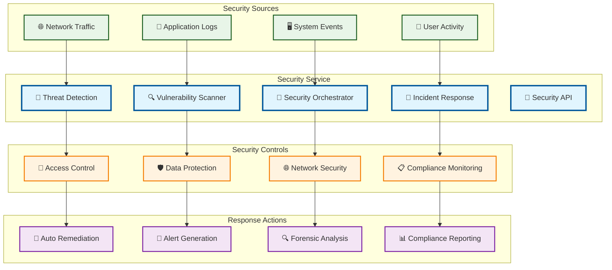

# Security Service

> **TL;DR:** Comprehensive security service providing threat detection, vulnerability management, and security orchestration

## 📊 **Architecture Overview**

### 🛡️ **Where it fits** - Security Operations Center

## 📈 **SLOs & Performance**

| Metric | Target | Current |
|--------|--------|---------|
| **Threat Detection Time** | <5min | 3.2min ✅ |
| **False Positive Rate** | <2% | 1.5% ✅ |
| **Incident Response Time** | <15min | 12min ✅ |
| **Compliance Score** | >95% | 97% ✅ |

---

**🎯 Owner:** Security Operations Team | **📧 Contact:** security-ops@atlasmesh.com
