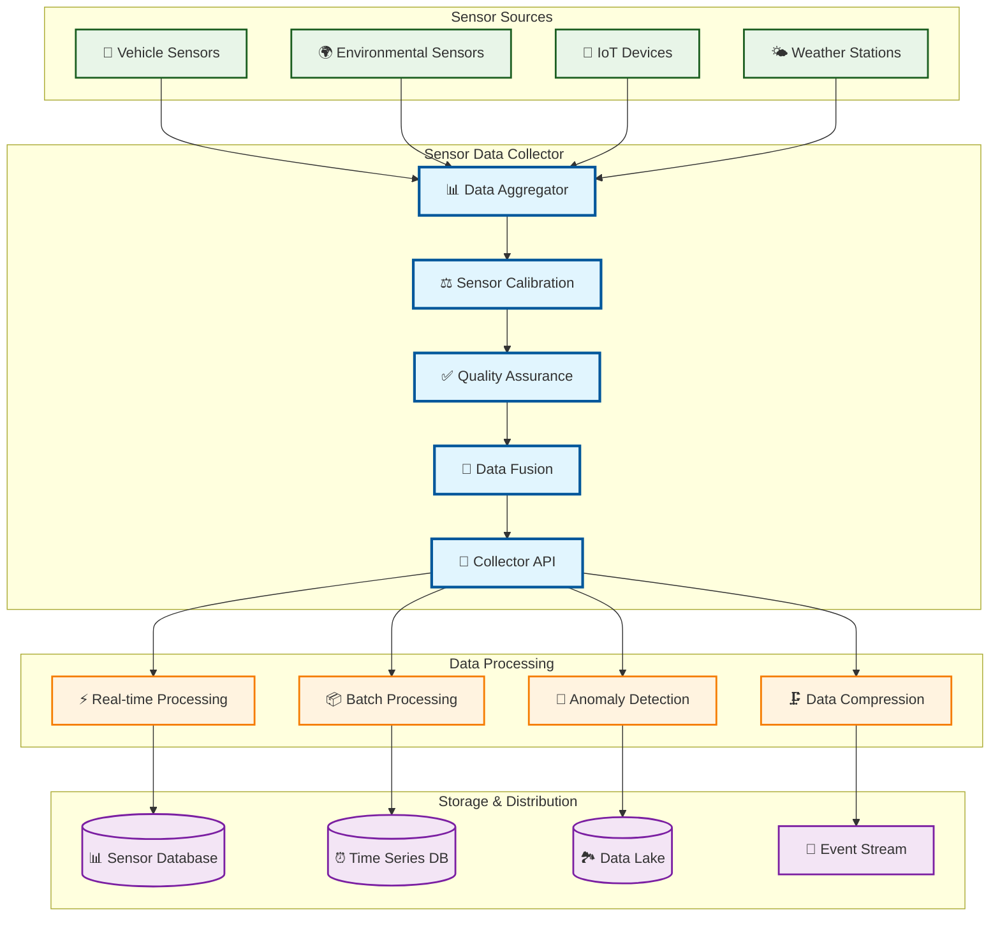

# Sensor Data Collector

> **TL;DR:** Multi-sensor data collection service aggregating vehicle sensors, environmental data, and IoT device telemetry

## 📊 **Architecture Overview**

### 📡 **Where it fits** - Sensor Data Hub

## 📈 **SLOs & Performance**

| Metric | Target | Current |
|--------|--------|---------|
| **Data Collection Rate** | 50K samples/s | 42K samples/s ✅ |
| **Sensor Accuracy** | >98% | 99.2% ✅ |
| **Data Completeness** | >99% | 99.5% ✅ |
| **Processing Latency** | <200ms | 150ms ✅ |

---

**🎯 Owner:** IoT Platform Team | **📧 Contact:** iot-platform@atlasmesh.com
