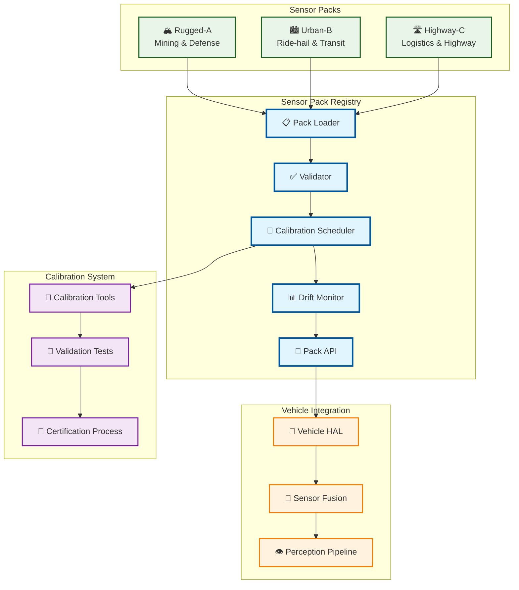
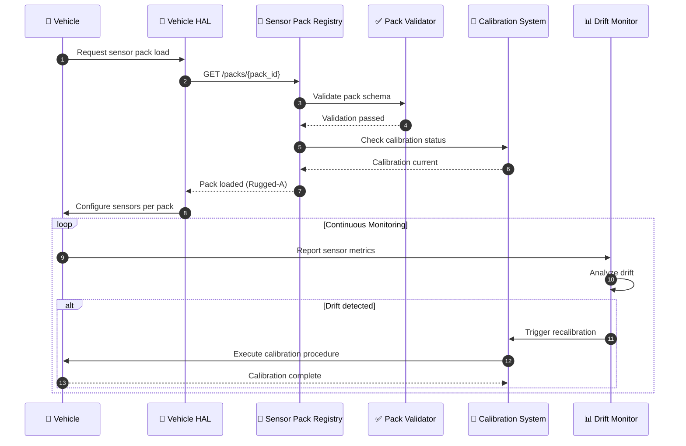

# Sensor Pack Registry Service

> **TL;DR:** Centralized registry for certified sensor pack definitions, calibration automation, and drift monitoring

## 📊 **Architecture Overview**

### 📡 **Where it fits** - Sensor Abstraction Hub


### ⚡ **How it talks** - Pack Loading & Validation


### 🔧 **What it owns** - Certified Pack Catalog
```mermaid
flowchart TB
    subgraph "Sensor Pack Catalog"
        Pack1[🏔️ Rugged-A<br/>6 LiDAR, 12 cameras, 8 radar]
        Pack2[🏙️ Urban-B<br/>4 LiDAR, 16 cameras, 6 radar]
        Pack3[🛣️ Highway-C<br/>4 LiDAR, 8 cameras, 6 radar]
    end
    
    subgraph "Pack Components"
        SensorSpec[📡 Sensor Specifications<br/>Models, counts, specs]
        CalibrationProc[🔧 Calibration Procedures<br/>Schedules, tools, steps]
        FusionConfig[🔄 Fusion Configuration<br/>Algorithms, thresholds]
        ValidationReqs[✅ Validation Requirements<br/>HiL, track, field tests]
    end
    
    subgraph "Certification"
        HiLTests[🧪 HiL Tests<br/>Hardware-in-loop validation]
        TrackTests[🏁 Track Tests<br/>Closed-course testing]
        FieldTests[🌍 Field Tests<br/>Real-world validation]
        Certification[📜 Pack Certification<br/>Safety & performance certified]
    end
    
    Pack1 --> SensorSpec
    Pack2 --> CalibrationProc
    Pack3 --> FusionConfig
    
    SensorSpec --> ValidationReqs
    CalibrationProc --> ValidationReqs
    FusionConfig --> ValidationReqs
    
    ValidationReqs --> HiLTests
    HiLTests --> TrackTests
    TrackTests --> FieldTests
    FieldTests --> Certification
    
    classDef pack fill:#e8f5e8,stroke:#388e3c,stroke-width:2px
    classDef component fill:#e3f2fd,stroke:#1976d2,stroke-width:2px
    classDef certification fill:#fff3e0,stroke:#f57c00,stroke-width:2px
    
    class Pack1,Pack2,Pack3 pack
    class SensorSpec,CalibrationProc,FusionConfig,ValidationReqs component
    class HiLTests,TrackTests,FieldTests,Certification certification
```

## 🔗 **API Contracts**

| Endpoint | Method | Description |
|----------|--------|-------------|
| `/api/v1/packs` | `GET` | List all certified sensor packs |
| `/api/v1/packs/{packId}` | `GET` | Get sensor pack details |
| `/api/v1/packs/{packId}/calibrate` | `POST` | Trigger calibration procedure |
| `/api/v1/packs/{packId}/drift` | `GET` | Get drift metrics |

## 🚀 **Quick Start**

```bash
# Start sensor pack registry
make dev.sensor-pack-registry

# List certified packs
curl http://localhost:8082/api/v1/packs

# Get pack details
curl http://localhost:8082/api/v1/packs/rugged-a

# Health check
curl http://localhost:8082/health
```

## 📈 **SLOs & Performance**

| Metric | Target | Current |
|--------|--------|---------|
| **Pack Load Time** | <500ms | TBD |
| **Calibration Scheduling** | 100% on-time | TBD |
| **Drift Detection Latency** | <1min | TBD |
| **Availability** | 99.9% | TBD |

## 📦 **Certified Sensor Packs**

### **Rugged Pack A** (Mining & Defense)
- **LiDAR**: 6× Velodyne HDL-32E (360°, 200m range, IP67)
- **Cameras**: 12× FLIR Blackfly S (1920x1200, night vision)
- **Radar**: 8× Continental ARS540 (300m range)
- **Supplemental**: 16× ultrasonic, 4× thermal
- **Calibration**: Daily + monthly procedures
- **Use Cases**: Open-pit mining, desert convoy operations

### **Urban Pack B** (Ride-hail & Transit)
- **LiDAR**: 4× Ouster OS2-128 (360°, 120m range, IP68)
- **Cameras**: 10× Sony IMX490 (2880x1860, night vision) + 6× AR0231 (1920x1080)
- **Radar**: 6× Arbe Phoenix (200m range)
- **Supplemental**: 12× ultrasonic, 4× perimeter radar
- **Calibration**: Weekly + quarterly procedures
- **Use Cases**: Urban ride-hail, public transit

### **Highway Pack C** (Logistics)
- **LiDAR**: 4× Luminar Iris (120° FOV, 250m range)
- **Cameras**: 8× OmniVision OV2312 (2048x1280)
- **Radar**: 6× Bosch LRR4 (250m range)
- **Supplemental**: 2× lane marker, 4× microphone
- **Calibration**: Monthly + semi-annual procedures
- **Use Cases**: Highway logistics, long-haul transport

## 🛡️ **Safety & Compliance**

- **Pack Certification**: Each pack certified for specific vehicle classes
- **HiL Testing**: Hardware-in-loop validation per pack
- **Track Testing**: Closed-course performance validation
- **Field Testing**: Real-world operational validation
- **Drift Monitoring**: Continuous sensor performance tracking

## 📊 **Monitoring & Validation**

- **Pack Dashboard** - [Sensor Pack Metrics](https://grafana.atlasmesh.com/d/sensor-packs)
- **Drift Monitoring** - Real-time sensor performance tracking
- **Calibration Tracking** - Automated calibration scheduling and verification
- **Pack Health** - Overall pack health and degradation metrics

## 🆘 **Troubleshooting**

| Issue | Solution |
|-------|----------|
| Pack load failures | Validate JSON schema, check file permissions |
| Calibration scheduling errors | Verify calibration procedures, check tool availability |
| Drift alerts | Review sensor health, schedule recalibration |
| Pack swap failures | Verify pack compatibility, check vehicle class |

---

**🎯 Owner:** Perception Team | **📧 Contact:** perception@atlasmesh.com
