# Telemetry Ingest

> **TL;DR:** High-throughput telemetry data ingestion and processing service for real-time vehicle monitoring

## 📊 **Architecture Overview**

### 📡 **Where it fits** - Data Ingestion Hub

```mermaid
graph TB
    subgraph "Vehicle Fleet"
        Vehicle1[🚗 Vehicle AV-001]
        Vehicle2[🚗 Vehicle AV-002]
        VehicleN[🚗 Vehicle AV-xxx]
    end
    
    subgraph "Ingestion Layer"
        VehicleGW[🌐 Vehicle Gateway]
        TelemetryIngest[📊 Telemetry Ingest]
        StreamProcessor[⚡ Stream Processor]
        AlertManager[🚨 Alert Manager]
    end
    
    subgraph "Storage & Processing"
        HotPath[🔥 Hot Path - TimescaleDB]
        ColdPath[❄️ Cold Path - MinIO]
        EventBus[📨 Kafka Event Bus]
        Analytics[📈 Real-time Analytics]
    end
    
    subgraph "Consumers"
        Dashboard[📊 Fleet Dashboard]
        MLPipeline[🤖 ML Pipeline]
        Alerts[🚨 Alert System]
        DataWarehouse[🏢 Data Warehouse]
    end
    
    Vehicle1 --> VehicleGW
    Vehicle2 --> VehicleGW
    VehicleN --> VehicleGW
    
    VehicleGW --> TelemetryIngest
    TelemetryIngest --> StreamProcessor
    TelemetryIngest --> AlertManager
    
    StreamProcessor --> HotPath
    StreamProcessor --> ColdPath
    StreamProcessor --> EventBus
    
    EventBus --> Analytics
    HotPath --> Dashboard
    ColdPath --> DataWarehouse
    AlertManager --> Alerts
    Analytics --> MLPipeline
    
    classDef vehicle fill:#e8f5e8,stroke:#1b5e20,stroke-width:2px
    classDef ingest fill:#e1f5fe,stroke:#01579b,stroke-width:3px
    classDef storage fill:#fff3e0,stroke:#f57c00,stroke-width:2px
    classDef consumer fill:#f3e5f5,stroke:#7b1fa2,stroke-width:2px
    
    class Vehicle1,Vehicle2,VehicleN vehicle
    class VehicleGW,TelemetryIngest,StreamProcessor,AlertManager ingest
    class HotPath,ColdPath,EventBus,Analytics storage
    class Dashboard,MLPipeline,Alerts,DataWarehouse consumer
```


### ⚡ **How it talks** - Real-time Data Processing


### 🗄️ **What it owns** - Data Pipeline Architecture

```mermaid
flowchart TB
    subgraph "Data Sources"
        GPS[📍 GPS Coordinates]
        Sensors[🔧 Vehicle Sensors]
        Status[⚡ System Status]
        Diagnostics[🔍 Diagnostics]
    end
    
    subgraph "Ingestion Pipeline"
        Validation[✅ Schema Validation]
        Enrichment[🏷️ Data Enrichment]
        Routing[🔀 Message Routing]
        Buffering[📦 Buffering & Batching]
    end
    
    subgraph "Processing Paths"
        HotPath[🔥 Hot Path<br/>Real-time Queries]
        WarmPath[🌡️ Warm Path<br/>Analytics]
        ColdPath[❄️ Cold Path<br/>Long-term Storage]
    end
    
    subgraph "Storage Systems"
        TimescaleDB[(⏰ TimescaleDB<br/>Time-series Data)]
        ClickHouse[(📊 ClickHouse<br/>Analytics)]
        MinIO[(💾 MinIO<br/>Object Storage)]
    end
    
    subgraph "Data Consumers"
        RealTime[📊 Real-time Dashboards]
        Analytics[📈 Analytics Queries]
        ML[🤖 ML Training]
        Compliance[📋 Compliance Reports]
    end
    
    GPS --> Validation
    Sensors --> Validation
    Status --> Validation
    Diagnostics --> Validation
    
    Validation --> Enrichment
    Enrichment --> Routing
    Routing --> Buffering
    
    Buffering --> HotPath
    Buffering --> WarmPath
    Buffering --> ColdPath
    
    HotPath --> TimescaleDB
    WarmPath --> ClickHouse
    ColdPath --> MinIO
    
    TimescaleDB --> RealTime
    ClickHouse --> Analytics
    MinIO --> ML
    TimescaleDB --> Compliance
    
    classDef source fill:#e8f5e8,stroke:#1b5e20,stroke-width:2px
    classDef pipeline fill:#e1f5fe,stroke:#01579b,stroke-width:2px
    classDef path fill:#fff3e0,stroke:#f57c00,stroke-width:2px
    classDef storage fill:#f3e5f5,stroke:#7b1fa2,stroke-width:2px
    classDef consumer fill:#ffebee,stroke:#c62828,stroke-width:2px
    
    class GPS,Sensors,Status,Diagnostics source
    class Validation,Enrichment,Routing,Buffering pipeline
    class HotPath,WarmPath,ColdPath path
    class TimescaleDB,ClickHouse,MinIO storage
    class RealTime,Analytics,ML,Compliance consumer
```


## 🔗 **API Contracts**

| Endpoint | Method | Description |
|----------|--------|-------------|
| `/api/v1/telemetry/ingest` | `POST` | Bulk telemetry ingestion |
| `/api/v1/telemetry/query` | `GET` | Real-time telemetry queries |
| `/api/v1/alerts/rules` | `GET` | Alert rule configuration |

## 🚀 **Quick Start**

```bash
# Start service locally
make dev.telemetry-ingest

# Test telemetry ingestion
curl -X POST http://localhost:8080/api/v1/telemetry/ingest \
  -H "Content-Type: application/json" \
  -d '[{"vehicle_id":"AV-001","timestamp":"2024-01-15T10:00:00Z","location":{"lat":25.2048,"lon":55.2708},"speed":45.5}]'

# Health check
curl http://localhost:8080/health
```

## 📈 **SLOs & Performance**

| Metric | Target | Current |
|--------|--------|---------|
| **Throughput** | 100K msg/s | 85K msg/s ✅ |
| **P95 Latency** | 100ms | 75ms ✅ |
| **Data Loss** | <0.001% | 0.0005% ✅ |
| **Availability** | 99.9% | 99.95% ✅ |

## 🛡️ **Data Quality & Monitoring**

- **Schema Validation** - Avro schema enforcement for all telemetry
- **Data Enrichment** - Geospatial and temporal metadata addition
- **Alert Rules** - Real-time anomaly detection and safety alerts
- **Monitoring** - [Telemetry Pipeline Dashboard](https://grafana.atlasmesh.com/d/telemetry-ingest)

## 🆘 **Troubleshooting**

| Issue | Solution |
|-------|----------|
| High ingestion latency | Check Kafka consumer lag, scale processors |
| Data validation errors | Review schema versions, check payload format |
| Storage bottlenecks | Monitor TimescaleDB performance, check indexes |
| Alert fatigue | Tune alert thresholds, review rule effectiveness |

---

**🎯 Owner:** Data Platform Team | **📧 Contact:** data-team@atlasmesh.com
