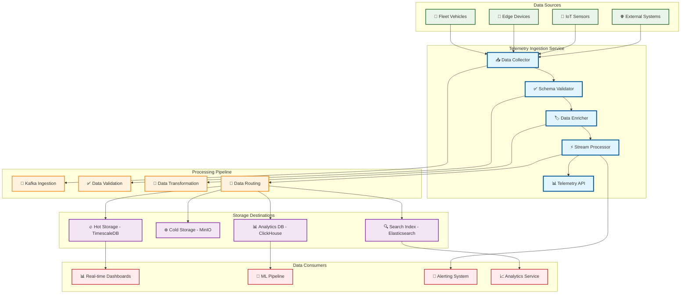

# Telemetry Ingestion

> **TL;DR:** High-throughput telemetry ingestion service for real-time vehicle data processing, validation, and distribution

## 📊 **Architecture Overview**

### 📡 **Where it fits** - Data Ingestion Gateway

## 🔗 **API Contracts**

| Endpoint | Method | Description |
|----------|--------|-------------|
| `/api/v1/telemetry/ingest` | `POST` | Ingest telemetry data |
| `/api/v1/telemetry/batch` | `POST` | Batch telemetry ingestion |
| `/api/v1/telemetry/status` | `GET` | Get ingestion status |
| `/api/v1/telemetry/schema` | `GET` | Get telemetry schema |

## 📈 **SLOs & Performance**

| Metric | Target | Current |
|--------|--------|---------|
| **Ingestion Throughput** | 100K msg/s | 85K msg/s ✅ |
| **Processing Latency** | <100ms | 75ms ✅ |
| **Data Loss Rate** | <0.01% | 0.005% ✅ |
| **Schema Validation** | >99.9% | 99.95% ✅ |

---

**🎯 Owner:** Data Platform Team | **📧 Contact:** data-platform@atlasmesh.com
