# Telemetry Ingestion

> **TL;DR:** High-throughput telemetry ingestion service for real-time vehicle data processing, validation, and distribution

## 📊 **Architecture Overview**

### 📡 **Where it fits** - Data Ingestion Gateway

```mermaid
graph TB
    subgraph "Data Sources"
        Vehicles[🚗 Fleet Vehicles]
        EdgeDevices[📱 Edge Devices]
        Sensors[📡 IoT Sensors]
        ExternalSystems[🌐 External Systems]
    end
    
    subgraph "Telemetry Ingestion Service"
        DataCollector[📥 Data Collector]
        SchemaValidator[✅ Schema Validator]
        DataEnricher[🏷️ Data Enricher]
        StreamProcessor[⚡ Stream Processor]
        TelemetryAPI[📊 Telemetry API]
    end
    
    subgraph "Processing Pipeline"
        KafkaIngestion[📨 Kafka Ingestion]
        DataValidation[✅ Data Validation]
        DataTransformation[🔄 Data Transformation]
        DataRouting[🔀 Data Routing]
    end
    
    subgraph "Storage Destinations"
        HotStorage[🔥 Hot Storage - TimescaleDB]
        ColdStorage[❄️ Cold Storage - MinIO]
        AnalyticsDB[📊 Analytics DB - ClickHouse]
        SearchIndex[🔍 Search Index - Elasticsearch]
    end
    
    subgraph "Data Consumers"
        RealTimeDashboards[📊 Real-time Dashboards]
        MLPipeline[🤖 ML Pipeline]
        AlertingSystem[🚨 Alerting System]
        AnalyticsService[📈 Analytics Service]
    end
    
    Vehicles --> DataCollector
    EdgeDevices --> DataCollector
    Sensors --> DataCollector
    ExternalSystems --> DataCollector
    
    DataCollector --> SchemaValidator
    SchemaValidator --> DataEnricher
    DataEnricher --> StreamProcessor
    StreamProcessor --> TelemetryAPI
    
    DataCollector --> KafkaIngestion
    SchemaValidator --> DataValidation
    DataEnricher --> DataTransformation
    StreamProcessor --> DataRouting
    
    DataRouting --> HotStorage
    DataRouting --> ColdStorage
    DataRouting --> AnalyticsDB
    DataRouting --> SearchIndex
    
    HotStorage --> RealTimeDashboards
    AnalyticsDB --> MLPipeline
    StreamProcessor --> AlertingSystem
    SearchIndex --> AnalyticsService
    
    classDef source fill:#e8f5e8,stroke:#1b5e20,stroke-width:2px
    classDef ingestion fill:#e1f5fe,stroke:#01579b,stroke-width:3px
    classDef pipeline fill:#fff3e0,stroke:#f57c00,stroke-width:2px
    classDef storage fill:#f3e5f5,stroke:#7b1fa2,stroke-width:2px
    classDef consumer fill:#ffebee,stroke:#c62828,stroke-width:2px
    
    class Vehicles,EdgeDevices,Sensors,ExternalSystems source
    class DataCollector,SchemaValidator,DataEnricher,StreamProcessor,TelemetryAPI ingestion
    class KafkaIngestion,DataValidation,DataTransformation,DataRouting pipeline
    class HotStorage,ColdStorage,AnalyticsDB,SearchIndex storage
    class RealTimeDashboards,MLPipeline,AlertingSystem,AnalyticsService consumer
```

## 🔗 **API Contracts**

| Endpoint | Method | Description |
|----------|--------|-------------|
| `/api/v1/telemetry/ingest` | `POST` | Ingest telemetry data |
| `/api/v1/telemetry/batch` | `POST` | Batch telemetry ingestion |
| `/api/v1/telemetry/status` | `GET` | Get ingestion status |
| `/api/v1/telemetry/schema` | `GET` | Get telemetry schema |

## 📈 **SLOs & Performance**

| Metric | Target | Current |
|--------|--------|---------|
| **Ingestion Throughput** | 100K msg/s | 85K msg/s ✅ |
| **Processing Latency** | <100ms | 75ms ✅ |
| **Data Loss Rate** | <0.01% | 0.005% ✅ |
| **Schema Validation** | >99.9% | 99.95% ✅ |

---

**🎯 Owner:** Data Platform Team | **📧 Contact:** data-platform@atlasmesh.com
