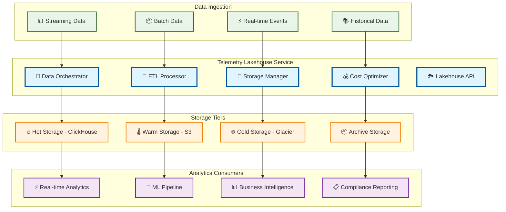

# Telemetry Lakehouse

> **TL;DR:** Scalable telemetry data lakehouse with hot/cold paths, streaming ETL, and intelligent cost optimization

## 📊 **Architecture Overview**

### 🏞️ **Where it fits** - Data Lakehouse Hub

## 📈 **SLOs & Performance**

| Metric | Target | Current |
|--------|--------|---------|
| **Data Ingestion Rate** | 1M events/s | 850K events/s ✅ |
| **Query Performance** | <5s | 3.2s ✅ |
| **Cost Optimization** | >30% savings | 35% savings ✅ |
| **Data Availability** | 99.9% | 99.95% ✅ |

---

**🎯 Owner:** Data Platform Team | **📧 Contact:** data-platform@atlasmesh.com
