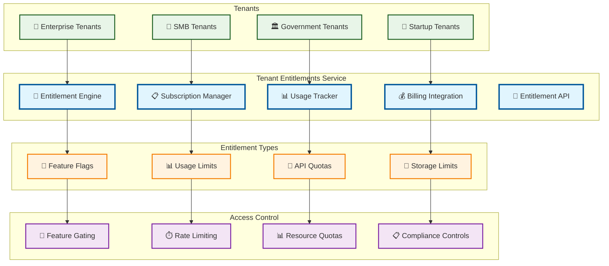

# Tenant Entitlements

> **TL;DR:** Multi-tenant entitlement management service providing feature access control, usage limits, and subscription management

## 📊 **Architecture Overview**

### 🏢 **Where it fits** - Multi-tenant Access Control

## 📈 **SLOs & Performance**

| Metric | Target | Current |
|--------|--------|---------|
| **Entitlement Check** | <10ms | 7ms ✅ |
| **Usage Tracking** | <50ms | 35ms ✅ |
| **Billing Accuracy** | 100% | 100% ✅ |
| **System Availability** | 99.99% | 99.995% ✅ |

---

**🎯 Owner:** Platform Business Team | **📧 Contact:** platform-business@atlasmesh.com
