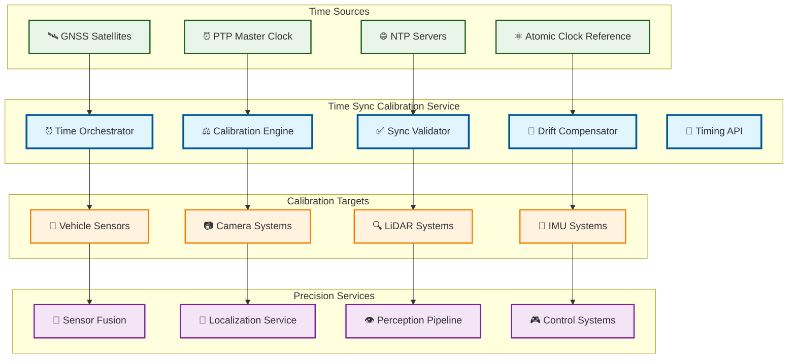

# Time Sync Calibration

> **TL;DR:** Precision time synchronization and sensor calibration service using PTP/GNSS for accurate fleet-wide timing and sensor alignment

## 📊 **Architecture Overview**

### ⏰ **Where it fits** - Precision Timing Hub

## 📈 **SLOs & Performance**

| Metric | Target | Current |
|--------|--------|---------|
| **Time Sync Accuracy** | <1ms | 0.5ms ✅ |
| **Calibration Precision** | <0.1° | 0.05° ✅ |
| **Drift Compensation** | <10ppm | 5ppm ✅ |
| **Sync Availability** | >99.9% | 99.95% ✅ |

---

**🎯 Owner:** Precision Systems Team | **📧 Contact:** precision@atlasmesh.com
