# Trip Service

> **TL;DR:** Comprehensive trip management service handling trip planning, execution, tracking, and analytics for autonomous fleet operations

## 📊 **Architecture Overview**

### 🗺️ **Where it fits** - Trip Orchestration Hub

```mermaid
graph TB
    subgraph "Trip Requestors"
        Customers[👤 Customers]
        FleetOperators[👨‍💼 Fleet Operators]
        AutomatedSystems[🤖 Automated Systems]
        EmergencyServices[🚨 Emergency Services]
    end
    
    subgraph "Trip Service"
        TripPlanner[🗺️ Trip Planner]
        RouteOptimizer[⚡ Route Optimizer]
        TripExecutor[🚀 Trip Executor]
        TripTracker[📍 Trip Tracker]
        TripAPI[🔌 Trip API]
    end
    
    subgraph "Supporting Services"
        FleetManager[🚛 Fleet Manager]
        VehicleGateway[🌐 Vehicle Gateway]
        RoutingService[🗺️ Routing Service]
        WeatherFusion[🌤️ Weather Fusion]
        PolicyEngine[⚖️ Policy Engine]
    end
    
    subgraph "Data Storage"
        TripDatabase[(🗄️ Trip Database)]
        RouteCache[(💾 Route Cache)]
        TelemetryStore[(📊 Telemetry Store)]
        AnalyticsDB[(📈 Analytics DB)]
    end
    
    subgraph "Real-time Processing"
        EventStream[📨 Event Stream]
        LocationTracking[📍 Location Tracking]
        ETACalculation[⏰ ETA Calculation]
        AlertSystem[🚨 Alert System]
    end
    
    Customers --> TripAPI
    FleetOperators --> TripAPI
    AutomatedSystems --> TripAPI
    EmergencyServices --> TripAPI
    
    TripAPI --> TripPlanner
    TripPlanner --> RouteOptimizer
    RouteOptimizer --> TripExecutor
    TripExecutor --> TripTracker
    
    TripPlanner --> FleetManager
    RouteOptimizer --> RoutingService
    TripExecutor --> VehicleGateway
    TripTracker --> WeatherFusion
    TripAPI --> PolicyEngine
    
    TripPlanner --> TripDatabase
    RouteOptimizer --> RouteCache
    TripTracker --> TelemetryStore
    TripExecutor --> AnalyticsDB
    
    TripTracker --> EventStream
    TripTracker --> LocationTracking
    TripExecutor --> ETACalculation
    TripAPI --> AlertSystem
    
    classDef requestor fill:#e8f5e8,stroke:#1b5e20,stroke-width:2px
    classDef trip fill:#e1f5fe,stroke:#01579b,stroke-width:3px
    classDef service fill:#fff3e0,stroke:#f57c00,stroke-width:2px
    classDef storage fill:#f3e5f5,stroke:#7b1fa2,stroke-width:2px
    classDef realtime fill:#ffebee,stroke:#c62828,stroke-width:2px
    
    class Customers,FleetOperators,AutomatedSystems,EmergencyServices requestor
    class TripPlanner,RouteOptimizer,TripExecutor,TripTracker,TripAPI trip
    class FleetManager,VehicleGateway,RoutingService,WeatherFusion,PolicyEngine service
    class TripDatabase,RouteCache,TelemetryStore,AnalyticsDB storage
    class EventStream,LocationTracking,ETACalculation,AlertSystem realtime
```


### ⚡ **How it talks** - Trip Lifecycle Management

```mermaid
sequenceDiagram
    autonumber
    participant Customer as 👤 Customer
    participant API as 🔌 Trip API
    participant Planner as 🗺️ Trip Planner
    participant Optimizer as ⚡ Route Optimizer
    participant Fleet as 🚛 Fleet Manager
    participant Vehicle as 🚗 Vehicle AV-001
    participant Tracker as 📍 Trip Tracker
    
    Note over Customer,Tracker: Trip Request & Planning
    Customer->>API: Request trip (pickup, destination)
    Note right of Customer: Trip booking request
    
    API->>Planner: Create trip plan
    Note right of API: Trip requirements and constraints
    
    Planner->>Optimizer: Optimize route
    Note right of Planner: Multi-objective optimization
    
    Optimizer->>Optimizer: Calculate optimal route
    Note right of Optimizer: Traffic, weather, efficiency
    
    Optimizer-->>Planner: Optimized route plan
    Planner->>Fleet: Request vehicle assignment
    Note right of Planner: Vehicle availability check
    
    Fleet-->>Planner: Vehicle AV-001 assigned
    Planner-->>API: Trip plan ready
    API-->>Customer: Trip confirmed (ETA, vehicle info)
    
    Note over Customer,Tracker: Trip Execution
    API->>Vehicle: Dispatch trip command
    Note right of API: Trip execution instructions
    
    Vehicle->>Vehicle: Navigate to pickup location
    Note right of Vehicle: Autonomous navigation
    
    Vehicle->>Tracker: Location updates
    Note right of Vehicle: Real-time position tracking
    
    Tracker->>Tracker: Update ETA calculations
    Note right of Tracker: Dynamic ETA updates
    
    Vehicle->>API: Arrived at pickup
    API->>Customer: Vehicle arrived notification
    
    Customer->>Vehicle: Board vehicle
    Vehicle->>API: Trip started
    
    loop During trip
        Vehicle->>Tracker: Continuous location updates
        Tracker->>API: Real-time trip progress
        API->>Customer: Trip progress updates
    end
    
    Vehicle->>API: Trip completed
    API->>Customer: Trip completion notification
    
    Note over Customer,Tracker: Complete trip lifecycle with real-time tracking
```


### 🚗 **What it owns** - Trip Management & Analytics

```mermaid
flowchart TB
    subgraph "Trip Planning"
        TripRequest[📝 Trip Request<br/>Pickup, destination, preferences]
        RouteCalculation[🗺️ Route Calculation<br/>Optimal path planning]
        VehicleAssignment[🚗 Vehicle Assignment<br/>Best vehicle selection]
        ETAEstimation[⏰ ETA Estimation<br/>Arrival time prediction]
    end
    
    subgraph "Trip Execution"
        TripDispatch[🚀 Trip Dispatch<br/>Vehicle command execution]
        RealTimeTracking[📍 Real-time Tracking<br/>Live location updates]
        DynamicRerouting[🔄 Dynamic Rerouting<br/>Adaptive route changes]
        IncidentHandling[🚨 Incident Handling<br/>Emergency response]
    end
    
    subgraph "Trip Analytics"
        PerformanceMetrics[📊 Performance Metrics<br/>Efficiency, punctuality]
        CostAnalysis[💰 Cost Analysis<br/>Trip profitability]
        CustomerSatisfaction[😊 Customer Satisfaction<br/>Ratings and feedback]
        OperationalInsights[🔍 Operational Insights<br/>Fleet optimization]
    end
    
    subgraph "Trip Types"
        ScheduledTrips[📅 Scheduled Trips<br/>Pre-planned journeys]
        OnDemandTrips[⚡ On-demand Trips<br/>Immediate requests]
        SharedTrips[👥 Shared Trips<br/>Multi-passenger rides]
        EmergencyTrips[🚨 Emergency Trips<br/>Priority response]
    end
    
    subgraph "Quality Assurance"
        TripValidation[✅ Trip Validation<br/>Request verification]
        SafetyChecks[🛡️ Safety Checks<br/>Vehicle and route safety]
        ComplianceMonitoring[📋 Compliance Monitoring<br/>Regulatory adherence]
        QualityScoring[⭐ Quality Scoring<br/>Service quality metrics]
    end
    
    TripRequest --> TripDispatch
    RouteCalculation --> RealTimeTracking
    VehicleAssignment --> DynamicRerouting
    ETAEstimation --> IncidentHandling
    
    TripDispatch --> PerformanceMetrics
    RealTimeTracking --> CostAnalysis
    DynamicRerouting --> CustomerSatisfaction
    IncidentHandling --> OperationalInsights
    
    PerformanceMetrics --> ScheduledTrips
    CostAnalysis --> OnDemandTrips
    CustomerSatisfaction --> SharedTrips
    OperationalInsights --> EmergencyTrips
    
    ScheduledTrips --> TripValidation
    OnDemandTrips --> SafetyChecks
    SharedTrips --> ComplianceMonitoring
    EmergencyTrips --> QualityScoring
    
    classDef planning fill:#e8f5e8,stroke:#388e3c,stroke-width:2px
    classDef execution fill:#e3f2fd,stroke:#1976d2,stroke-width:2px
    classDef analytics fill:#fff3e0,stroke:#f57c00,stroke-width:2px
    classDef types fill:#f3e5f5,stroke:#7b1fa2,stroke-width:2px
    classDef quality fill:#ffebee,stroke:#c62828,stroke-width:2px
    
    class TripRequest,RouteCalculation,VehicleAssignment,ETAEstimation planning
    class TripDispatch,RealTimeTracking,DynamicRerouting,IncidentHandling execution
    class PerformanceMetrics,CostAnalysis,CustomerSatisfaction,OperationalInsights analytics
    class ScheduledTrips,OnDemandTrips,SharedTrips,EmergencyTrips types
    class TripValidation,SafetyChecks,ComplianceMonitoring,QualityScoring quality
```


## 🔗 **API Contracts**

| Endpoint | Method | Description |
|----------|--------|-------------|
| `/api/v1/trips` | `POST` | Create new trip request |
| `/api/v1/trips/{id}` | `GET` | Get trip details |
| `/api/v1/trips/{id}/track` | `GET` | Get real-time trip tracking |
| `/api/v1/trips/{id}/cancel` | `POST` | Cancel active trip |

## 🚀 **Quick Start**

```bash
# Start trip service
make dev.trip-service

# Create a new trip
curl -X POST http://localhost:8080/api/v1/trips \
  -H "Content-Type: application/json" \
  -d '{"pickup":{"lat":25.2048,"lon":55.2708},"destination":{"lat":25.1972,"lon":55.2744},"passenger_count":2}'

# Track active trip
curl http://localhost:8080/api/v1/trips/trip-12345/track

# Get trip analytics
curl http://localhost:8080/api/v1/trips/analytics?timeframe=24h

# Health check
curl http://localhost:8080/health
```

## 📈 **SLOs & Performance**

| Metric | Target | Current |
|--------|--------|---------|
| **Trip Planning Time** | <5s | 3.2s ✅ |
| **ETA Accuracy** | >90% | 93% ✅ |
| **Trip Completion Rate** | >98% | 99.1% ✅ |
| **Customer Satisfaction** | >4.5/5 | 4.7/5 ✅ |

## 🗺️ **Trip Management Features**

### **Route Optimization**
- **Multi-objective Optimization** - Time, cost, fuel efficiency, safety
- **Real-time Traffic Integration** - Dynamic traffic data incorporation
- **Weather-aware Routing** - Weather condition consideration
- **Predictive Analytics** - Historical data-driven optimization

### **Trip Types & Modes**
```yaml
# Trip Configuration
trip_types:
  scheduled:
    advance_booking: "24h"
    cancellation_window: "2h"
    
  on_demand:
    response_time: "5min"
    surge_pricing: enabled
    
  shared:
    max_passengers: 4
    detour_limit: "15min"
    
  emergency:
    priority: "highest"
    response_time: "2min"
```

### **Real-time Tracking**
- **GPS Tracking** - High-precision location monitoring
- **ETA Updates** - Dynamic arrival time calculation
- **Geofencing** - Location-based event triggers
- **Progress Notifications** - Customer and operator updates

## 🛡️ **Safety & Compliance**

### **Safety Features**
- **Route Safety Scoring** - Risk assessment for planned routes
- **Emergency Protocols** - Automated emergency response procedures
- **Incident Detection** - Real-time incident identification and response
- **Safety Analytics** - Continuous safety performance monitoring

### **Regulatory Compliance**
- **UAE RTA Compliance** - Local transportation authority requirements
- **Data Privacy** - GDPR and local privacy law compliance
- **Service Standards** - Quality of service regulatory requirements
- **Accessibility** - ADA and local accessibility standards

## 📊 **Analytics & Insights**

- **Trip Dashboard** - [Trip Operations Analytics](https://grafana.atlasmesh.com/d/trip-service)
- **Performance Metrics** - Efficiency, punctuality, customer satisfaction
- **Cost Analytics** - Trip profitability and cost optimization
- **Demand Forecasting** - Predictive demand analysis and capacity planning

## 🆘 **Troubleshooting**

| Issue | Solution |
|-------|----------|
| Poor ETA accuracy | Calibrate traffic models, improve historical data |
| High trip cancellation rate | Review pricing strategy, improve vehicle availability |
| Route optimization failures | Check routing service connectivity, validate constraints |
| Customer satisfaction decline | Analyze feedback, improve service quality metrics |

---

**🎯 Owner:** Trip Operations Team | **📧 Contact:** trip-ops@atlasmesh.com
