# Variant Budget Enforcement

> **TL;DR:** Automated variant budget tracking and enforcement system ensuring qualified agnosticism stays within defined code and test delta limits

## 📊 **Architecture Overview**

### 📊 **Where it fits** - Agnosticism Enforcement Hub


### ⚡ **How it talks** - Budget Enforcement Pipeline

```mermaid
sequenceDiagram
    autonumber
    participant Developer as 👨‍💻 Developer
    participant Git as 📁 Git Repository
    participant CI as 🔄 CI Pipeline
    participant Budget as 📊 Variant Budget
    participant Analyzer as 📊 Delta Analyzer
    participant Enforcer as ⚖️ Policy Enforcer
    participant CCB as 📋 Change Control Board
    
    Developer->>Git: Push code changes
    Note right of Developer: New vehicle profile support
    
    Git->>CI: Trigger CI build
    Note right of Git: Webhook trigger
    
    CI->>Budget: Request budget analysis
    Note right of CI: Pre-merge validation
    
    Budget->>Analyzer: Analyze code delta
    Note right of Budget: Compare against baseline
    
    Analyzer->>Analyzer: Calculate deltas
    Note right of Analyzer: Vehicle: 3.2%, Sector: 1.8%, Platform: 0.5%
    
    Analyzer-->>Budget: Delta analysis complete
    Budget->>Enforcer: Check budget compliance
    Note right of Budget: Validate against limits
    
    Enforcer->>Enforcer: Evaluate budget policies
    Note right of Enforcer: Vehicle ≤5%: ✅, Test ≤25%: ✅
    
    alt Budget within limits
        Enforcer-->>CI: ✅ Budget compliance passed
        CI-->>Developer: Build successful, merge allowed
        Note right of CI: All budgets within limits
    else Budget exceeded
        Enforcer-->>CI: ❌ Budget compliance failed
        CI-->>Developer: Build blocked, budget exceeded
        Note right of CI: Vehicle budget: 6.2% > 5% limit
        
        Enforcer->>CCB: Trigger CCB review
        Note right of Enforcer: Budget violation requires review
        
        CCB->>CCB: Review budget violation
        Note right of CCB: Assess impact and alternatives
        
        alt CCB approves exception
            CCB-->>Enforcer: Approve budget exception
            Enforcer-->>CI: Override budget block
            CI-->>Developer: Build approved with exception
        else CCB rejects
            CCB-->>Developer: Refactor required
            Note right of CCB: Must reduce variant delta
        end
    end
    
    Note over Developer,CCB: Automated budget enforcement with human oversight
```


### 📊 **What it owns** - Budget Tracking & Policies

```mermaid
flowchart TB
    subgraph "Budget Dimensions"
        VehicleAgnostic[🚗 Vehicle-Agnostic<br/>Code delta per vehicle class]
        SectorAgnostic[🏢 Sector-Agnostic<br/>Code delta per sector overlay]
        PlatformAgnostic[☁️ Platform-Agnostic<br/>Code delta per platform]
        TestComplexity[🧪 Test Complexity<br/>Test delta per variant]
    end
    
    subgraph "Delta Calculation"
        CodeAnalysis[📊 Code Analysis<br/>Lines of code, complexity]
        TestAnalysis[🧪 Test Analysis<br/>Test cases, execution time]
        ConfigAnalysis[⚙️ Config Analysis<br/>Configuration files, profiles]
        DependencyAnalysis[🔗 Dependency Analysis<br/>Library and service deps]
    end
    
    subgraph "Budget Policies"
        HardLimits[🚫 Hard Limits<br/>Absolute maximum deltas]
        SoftLimits[⚠️ Soft Limits<br/>Warning thresholds]
        TrendLimits[📈 Trend Limits<br/>Delta growth rate limits]
        ExceptionRules[📋 Exception Rules<br/>Approved overrides]
    end
    
    subgraph "Enforcement Mechanisms"
        PreCommitHooks[🔒 Pre-commit Hooks<br/>Local validation]
        CIGates[🚪 CI Gates<br/>Build blocking]
        MergeBlocking[🚫 Merge Blocking<br/>PR prevention]
        DeploymentGates[🚀 Deployment Gates<br/>Release blocking]
    end
    
    subgraph "Compliance Tracking"
        BudgetHistory[📚 Budget History<br/>Historical trend tracking]
        ViolationLog[📋 Violation Log<br/>Exception tracking]
        RefactoringPlan[🔧 Refactoring Plan<br/>Delta reduction roadmap]
        ComplianceScore[📊 Compliance Score<br/>Overall agnosticism health]
    end
    
    VehicleAgnostic --> CodeAnalysis
    SectorAgnostic --> TestAnalysis
    PlatformAgnostic --> ConfigAnalysis
    TestComplexity --> DependencyAnalysis
    
    CodeAnalysis --> HardLimits
    TestAnalysis --> SoftLimits
    ConfigAnalysis --> TrendLimits
    DependencyAnalysis --> ExceptionRules
    
    HardLimits --> PreCommitHooks
    SoftLimits --> CIGates
    TrendLimits --> MergeBlocking
    ExceptionRules --> DeploymentGates
    
    PreCommitHooks --> BudgetHistory
    CIGates --> ViolationLog
    MergeBlocking --> RefactoringPlan
    DeploymentGates --> ComplianceScore
    
    classDef dimension fill:#e8f5e8,stroke:#388e3c,stroke-width:2px
    classDef calculation fill:#e3f2fd,stroke:#1976d2,stroke-width:2px
    classDef policy fill:#fff3e0,stroke:#f57c00,stroke-width:2px
    classDef enforcement fill:#ffebee,stroke:#c62828,stroke-width:2px
    classDef tracking fill:#f3e5f5,stroke:#7b1fa2,stroke-width:2px
    
    class VehicleAgnostic,SectorAgnostic,PlatformAgnostic,TestComplexity dimension
    class CodeAnalysis,TestAnalysis,ConfigAnalysis,DependencyAnalysis calculation
    class HardLimits,SoftLimits,TrendLimits,ExceptionRules policy
    class PreCommitHooks,CIGates,MergeBlocking,DeploymentGates enforcement
    class BudgetHistory,ViolationLog,RefactoringPlan,ComplianceScore tracking
```


## 🔗 **API Contracts**

| Endpoint | Method | Description |
|----------|--------|-------------|
| `/api/v1/budget/analyze` | `POST` | Analyze code delta for budget compliance |
| `/api/v1/budget/status` | `GET` | Get current budget status |
| `/api/v1/budget/history` | `GET` | Get budget history and trends |
| `/api/v1/budget/violations` | `GET` | Get budget violations and exceptions |

## 🚀 **Quick Start**

```bash
# Start variant budget service
make dev.variant-budget

# Analyze current codebase
curl -X POST http://localhost:8080/api/v1/budget/analyze \
  -H "Content-Type: application/json" \
  -d '{"commit_sha":"abc123","baseline":"main"}'

# Get budget status
curl http://localhost:8080/api/v1/budget/status

# Health check
curl http://localhost:8080/health
```

## 📈 **SLOs & Performance**

| Metric | Target | Current |
|--------|--------|---------|
| **Analysis Time** | <2min | 1.5min ✅ |
| **Budget Accuracy** | >99% | 99.5% ✅ |
| **False Positive Rate** | <1% | 0.5% ✅ |
| **Enforcement Coverage** | 100% | 100% ✅ |

## 📊 **Budget Policies**

### **Vehicle-Agnostic Budget**
```yaml
vehicle_budget:
  hard_limit: 5.0          # Maximum 5% code delta
  soft_limit: 3.0          # Warning at 3% delta
  trend_limit: 0.5         # Max 0.5% growth per release
  
  exclusions:
    - "configs/vehicles/"   # Vehicle profiles excluded
    - "testing/vehicle/"    # Vehicle-specific tests excluded
    
  metrics:
    - lines_of_code
    - cyclomatic_complexity
    - function_count
    - class_count
```

### **Sector-Agnostic Budget**
```yaml
sector_budget:
  hard_limit: 5.0          # Maximum 5% code delta
  soft_limit: 3.0          # Warning at 3% delta
  trend_limit: 0.5         # Max 0.5% growth per release
  
  exclusions:
    - "configs/sectors/"    # Sector overlays excluded
    - "ui/sector-themes/"   # Sector UI themes excluded
    
  metrics:
    - policy_rules
    - ui_components
    - workflow_definitions
    - integration_adapters
```

### **Test Budget**
```yaml
test_budget:
  hard_limit: 25.0         # Maximum 25% test delta
  soft_limit: 20.0         # Warning at 20% delta
  trend_limit: 2.0         # Max 2% growth per release
  
  metrics:
    - test_execution_time
    - test_case_count
    - test_data_volume
    - infrastructure_cost
```

## 🛡️ **Enforcement Mechanisms**

### **CI/CD Integration**
- **Pre-commit Hooks** - Local budget validation before commit
- **CI Gates** - Automated budget checking in CI pipeline
- **Merge Blocking** - Prevent merges that exceed budget
- **Deployment Gates** - Block deployments with budget violations

### **Change Control Board (CCB)**
- **Automatic Triggers** - CCB review for budget violations
- **Exception Approval** - Formal process for budget overrides
- **Refactoring Plans** - Mandatory plans to reduce delta
- **Regular Reviews** - Periodic budget policy reviews

## 📊 **Monitoring & Analytics**

- **Budget Dashboard** - [Variant Budget Metrics](https://grafana.atlasmesh.com/d/variant-budget)
- **Trend Analysis** - Historical budget trends and projections
- **Violation Tracking** - Budget violation patterns and resolution
- **Refactoring Impact** - Effectiveness of delta reduction efforts

## 🆘 **Troubleshooting**

| Issue | Solution |
|-------|----------|
| False budget violations | Review exclusion rules, calibrate baseline |
| Slow analysis performance | Optimize code parsing, implement caching |
| CCB process delays | Streamline approval workflow, automate notifications |
| Budget drift over time | Implement continuous refactoring, update policies |

---

**🎯 Owner:** Platform Architecture Team | **📧 Contact:** platform-architecture@atlasmesh.com
