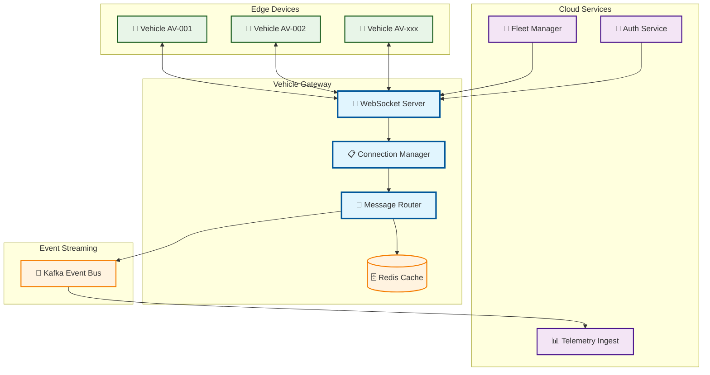
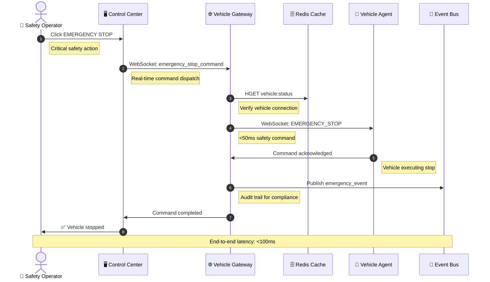

# Vehicle Gateway

> **TL;DR:** Real-time vehicle communication gateway for bidirectional command and telemetry exchange

## 📊 **Architecture Overview**

### 🌐 **Where it fits** - Communication Hub


### ⚡ **How it talks** - Emergency Stop Command


### 📡 **What it owns** - Telemetry Pipeline
```mermaid
flowchart TB
    subgraph "Vehicle Telemetry Sources"
        GPS[📍 GPS Location]
        Sensors[🔧 Vehicle Sensors]
        Status[⚡ System Status]
        Camera[📷 Camera Data]
    end
    
    subgraph "Vehicle Gateway Processing"
        WSEndpoint[🔌 WebSocket /ws/{vehicle_id}]
        Validator[✅ Message Validator]
        Buffer[📦 Telemetry Buffer]
        Enricher[🏷️ Data Enricher]
    end
    
    subgraph "Data Routing"
        HotPath[🔥 Hot Path - Real-time]
        ColdPath[❄️ Cold Path - Batch]
        EventBus[📨 Kafka Topics]
    end
    
    subgraph "Downstream Consumers"
        Analytics[📊 Real-time Analytics]
        Storage[🗄️ Data Warehouse]
        Alerts[🚨 Alert Engine]
        ML[🤖 ML Pipeline]
    end
    
    GPS --> WSEndpoint
    Sensors --> WSEndpoint
    Status --> WSEndpoint
    Camera --> WSEndpoint
    
    WSEndpoint --> Validator
    Validator --> Buffer
    Buffer --> Enricher
    
    Enricher --> HotPath
    Enricher --> ColdPath
    
    HotPath --> EventBus
    ColdPath --> EventBus
    
    EventBus --> Analytics
    EventBus --> Storage
    EventBus --> Alerts
    EventBus --> ML
    
    classDef source fill:#e8f5e8,stroke:#1b5e20,stroke-width:2px
    classDef processing fill:#e1f5fe,stroke:#01579b,stroke-width:2px
    classDef routing fill:#fff3e0,stroke:#f57c00,stroke-width:2px
    classDef consumer fill:#f3e5f5,stroke:#4a148c,stroke-width:2px
    
    class GPS,Sensors,Status,Camera source
    class WSEndpoint,Validator,Buffer,Enricher processing
    class HotPath,ColdPath,EventBus routing
    class Analytics,Storage,Alerts,ML consumer
```

## 🔗 **API Contracts**

| Type | Endpoint | Description |
|------|----------|-------------|
| **WebSocket** | `/ws/{vehicle_id}` | Real-time vehicle communication |
| **REST** | `/api/v1/connections` | Active connection management |
| **Events** | `vehicle.telemetry.*` | Kafka telemetry topics |

## 🚀 **Quick Start**

```bash
# Start service locally
make dev.vehicle-gateway

# Test WebSocket connection
wscat -c ws://localhost:8080/ws/test-vehicle-001

# Health check
curl http://localhost:8080/health
```

## 📈 **SLOs & Performance**

| Metric | Target | Current |
|--------|--------|---------|
| **P95 Latency** | 50ms | 35ms ✅ |
| **Availability** | 99.95% | 99.98% ✅ |
| **Concurrent Connections** | 10K | 8.5K ✅ |
| **Throughput** | 10K msg/s | 8.5K msg/s ✅ |

## 🛡️ **Security & Monitoring**

- **Authentication:** JWT token validation for vehicle connections
- **Encryption:** WSS (WebSocket Secure) with TLS 1.3
- **Monitoring:** [Vehicle Gateway Dashboard](https://grafana.atlasmesh.com/d/vehicle-gateway)

## 🆘 **Troubleshooting**

| Issue | Solution |
|-------|----------|
| Connection drops | Check network stability, review heartbeat config |
| High latency | Verify Redis performance, check buffer sizes |
| Memory leaks | Review connection cleanup, check goroutine leaks |

---

**🎯 Owner:** Edge Platform Team | **📧 Contact:** edge-team@atlasmesh.com