# Weather Fusion

> **TL;DR:** Multi-source weather data fusion service providing confidence-scored weather intelligence for autonomous vehicle operations

## 📊 **Architecture Overview**

### 🌤️ **Where it fits** - Weather Intelligence Hub

```mermaid
graph TB
    subgraph "Weather Data Sources"
        NCMS[🇦🇪 UAE NCMS]
        OpenWeather[🌍 OpenWeatherMap]
        AccuWeather[🌦️ AccuWeather]
        LocalSensors[📡 Local Weather Stations]
        VehicleSensors[🚗 Vehicle Weather Sensors]
    end
    
    subgraph "Weather Fusion Service"
        DataCollector[📥 Data Collector]
        FusionEngine[🔄 Fusion Engine]
        ConfidenceScorer[📊 Confidence Scorer]
        WeatherAPI[🌤️ Weather API]
        AlertEngine[🚨 Alert Engine]
    end
    
    subgraph "Fusion Algorithms"
        WeightedAverage[⚖️ Weighted Average]
        KalmanFilter[🎯 Kalman Filter]
        BayesianFusion[🧠 Bayesian Fusion]
        MLPredictor[🤖 ML Predictor]
    end
    
    subgraph "Weather Consumers"
        FleetManager[🚛 Fleet Manager]
        PolicyEngine[⚖️ Policy Engine]
        RouteOptimizer[🗺️ Route Optimizer]
        SafetyMonitor[🛡️ Safety Monitor]
        Dashboard[📊 Weather Dashboard]
    end
    
    subgraph "Data Storage"
        TimeSeries[(⏰ Weather Time Series)]
        ForecastCache[(🔮 Forecast Cache)]
        HistoricalData[(📚 Historical Data)]
    end
    
    NCMS --> DataCollector
    OpenWeather --> DataCollector
    AccuWeather --> DataCollector
    LocalSensors --> DataCollector
    VehicleSensors --> DataCollector
    
    DataCollector --> FusionEngine
    FusionEngine --> WeightedAverage
    FusionEngine --> KalmanFilter
    FusionEngine --> BayesianFusion
    FusionEngine --> MLPredictor
    
    WeightedAverage --> ConfidenceScorer
    KalmanFilter --> ConfidenceScorer
    BayesianFusion --> ConfidenceScorer
    MLPredictor --> ConfidenceScorer
    
    ConfidenceScorer --> WeatherAPI
    ConfidenceScorer --> AlertEngine
    
    WeatherAPI --> FleetManager
    WeatherAPI --> PolicyEngine
    WeatherAPI --> RouteOptimizer
    AlertEngine --> SafetyMonitor
    WeatherAPI --> Dashboard
    
    FusionEngine --> TimeSeries
    ConfidenceScorer --> ForecastCache
    DataCollector --> HistoricalData
    
    classDef source fill:#e8f5e8,stroke:#1b5e20,stroke-width:2px
    classDef fusion fill:#e1f5fe,stroke:#01579b,stroke-width:3px
    classDef algorithm fill:#fff3e0,stroke:#f57c00,stroke-width:2px
    classDef consumer fill:#f3e5f5,stroke:#7b1fa2,stroke-width:2px
    classDef storage fill:#ffebee,stroke:#c62828,stroke-width:2px
    
    class NCMS,OpenWeather,AccuWeather,LocalSensors,VehicleSensors source
    class DataCollector,FusionEngine,ConfidenceScorer,WeatherAPI,AlertEngine fusion
    class WeightedAverage,KalmanFilter,BayesianFusion,MLPredictor algorithm
    class FleetManager,PolicyEngine,RouteOptimizer,SafetyMonitor,Dashboard consumer
    class TimeSeries,ForecastCache,HistoricalData storage
```


### ⚡ **How it talks** - Multi-Source Fusion Process


### 🌦️ **What it owns** - Weather Intelligence & Algorithms

```mermaid
flowchart TB
    subgraph "Weather Parameters"
        Temperature[🌡️ Temperature]
        Humidity[💧 Humidity]
        Precipitation[🌧️ Precipitation]
        WindSpeed[💨 Wind Speed]
        Visibility[👁️ Visibility]
        Pressure[📊 Atmospheric Pressure]
    end
    
    subgraph "Fusion Algorithms"
        WeightedFusion[⚖️ Weighted Fusion<br/>Source reliability weights]
        KalmanFusion[🎯 Kalman Filter<br/>Temporal smoothing]
        BayesianFusion[🧠 Bayesian Fusion<br/>Uncertainty quantification]
        MLFusion[🤖 ML Fusion<br/>Pattern learning]
    end
    
    subgraph "Confidence Metrics"
        SourceAgreement[🤝 Source Agreement]
        HistoricalAccuracy[📈 Historical Accuracy]
        DataFreshness[⏰ Data Freshness]
        SpatialConsistency[🗺️ Spatial Consistency]
    end
    
    subgraph "Weather Intelligence"
        CurrentConditions[🌤️ Current Conditions]
        ShortTermForecast[⏱️ 1-6 Hour Forecast]
        MediumTermForecast[📅 6-24 Hour Forecast]
        WeatherAlerts[🚨 Weather Alerts]
    end
    
    subgraph "Operational Impact"
        VisibilityImpact[👁️ Visibility Impact<br/>Camera/LiDAR performance]
        RoadConditions[🛣️ Road Conditions<br/>Wet/dry/icy surfaces]
        SafetyThresholds[⚠️ Safety Thresholds<br/>Operation limits]
        RouteRecommendations[🗺️ Route Recommendations<br/>Weather-optimized paths]
    end
    
    Temperature --> WeightedFusion
    Humidity --> KalmanFusion
    Precipitation --> BayesianFusion
    WindSpeed --> MLFusion
    Visibility --> WeightedFusion
    Pressure --> KalmanFusion
    
    WeightedFusion --> SourceAgreement
    KalmanFusion --> HistoricalAccuracy
    BayesianFusion --> DataFreshness
    MLFusion --> SpatialConsistency
    
    SourceAgreement --> CurrentConditions
    HistoricalAccuracy --> ShortTermForecast
    DataFreshness --> MediumTermForecast
    SpatialConsistency --> WeatherAlerts
    
    CurrentConditions --> VisibilityImpact
    ShortTermForecast --> RoadConditions
    MediumTermForecast --> SafetyThresholds
    WeatherAlerts --> RouteRecommendations
    
    classDef parameter fill:#e8f5e8,stroke:#388e3c,stroke-width:2px
    classDef algorithm fill:#e3f2fd,stroke:#1976d2,stroke-width:2px
    classDef confidence fill:#fff3e0,stroke:#f57c00,stroke-width:2px
    classDef intelligence fill:#f3e5f5,stroke:#7b1fa2,stroke-width:2px
    classDef impact fill:#ffebee,stroke:#c62828,stroke-width:2px
    
    class Temperature,Humidity,Precipitation,WindSpeed,Visibility,Pressure parameter
    class WeightedFusion,KalmanFusion,BayesianFusion,MLFusion algorithm
    class SourceAgreement,HistoricalAccuracy,DataFreshness,SpatialConsistency confidence
    class CurrentConditions,ShortTermForecast,MediumTermForecast,WeatherAlerts intelligence
    class VisibilityImpact,RoadConditions,SafetyThresholds,RouteRecommendations impact
```


## 🔗 **API Contracts**

| Endpoint | Method | Description |
|----------|--------|-------------|
| `/api/v1/weather/current` | `GET` | Current weather with confidence |
| `/api/v1/weather/forecast` | `GET` | Multi-horizon weather forecast |
| `/api/v1/weather/alerts` | `GET` | Active weather alerts |
| `/api/v1/weather/impact` | `GET` | Operational impact assessment |

## 🚀 **Quick Start**

```bash
# Start weather fusion service
make dev.weather-fusion

# Get current weather for Abu Dhabi
curl "http://localhost:8080/api/v1/weather/current?lat=24.4539&lon=54.3773"

# Get weather forecast with confidence
curl "http://localhost:8080/api/v1/weather/forecast?lat=24.4539&lon=54.3773&hours=6"

# Health check
curl http://localhost:8080/health
```

## 📈 **SLOs & Performance**

| Metric | Target | Current |
|--------|--------|---------|
| **Data Freshness** | <5 min | 3.2 min ✅ |
| **Fusion Accuracy** | >85% | 89% ✅ |
| **API Latency** | <200ms | 150ms ✅ |
| **Availability** | 99.9% | 99.95% ✅ |

## 🌤️ **Weather Intelligence Features**

### **Multi-Source Fusion**
- **UAE NCMS** - Official national weather service (high weight)
- **OpenWeatherMap** - Global weather data (medium weight)
- **AccuWeather** - Commercial weather service (medium weight)
- **Local Sensors** - Ground truth data (highest weight when available)
- **Vehicle Sensors** - Real-time field observations (validation data)

### **Confidence Scoring**
```yaml
# Confidence Calculation
confidence_score = (
  source_agreement * 0.4 +
  historical_accuracy * 0.3 +
  data_freshness * 0.2 +
  spatial_consistency * 0.1
)

# Operational Thresholds
high_confidence: >80%    # Normal operations
medium_confidence: 50-80% # Proceed with caution
low_confidence: <50%     # Consider restrictions
```

## 🛡️ **Safety & Compliance**

- **UAE Weather Standards** - Compliance with national meteorological standards
- **Autonomous Vehicle Safety** - Weather-based operational limits
- **Data Quality Assurance** - Multi-source validation and anomaly detection
- **Alert System** - Real-time weather hazard notifications

## 📊 **Monitoring & Alerting**

- **Weather Dashboard** - [Weather Fusion Metrics](https://grafana.atlasmesh.com/d/weather-fusion)
- **Source Health** - Individual weather source availability and accuracy
- **Fusion Performance** - Algorithm accuracy and confidence distribution
- **Operational Impact** - Weather-related fleet operational metrics

## 🆘 **Troubleshooting**

| Issue | Solution |
|-------|----------|
| Low confidence scores | Check source availability, review fusion weights |
| Stale weather data | Verify API connectivity, check data collection intervals |
| Fusion algorithm errors | Review input data quality, check algorithm parameters |
| High API latency | Optimize caching strategy, review database performance |

---

**🎯 Owner:** Data Intelligence Team | **📧 Contact:** data-intelligence@atlasmesh.com
