# Zero Trust IAM

> **TL;DR:** Zero-trust identity and access management service implementing SPIFFE/SPIRE for service identity and mTLS authentication

## 📊 **Architecture Overview**

### 🔐 **Where it fits** - Zero Trust Security Foundation

```mermaid
graph TB
    subgraph "Identity Sources"
        Users[👤 Human Users]
        Services[⚙️ Services]
        Devices[📱 Devices]
        Workloads[🤖 Workloads]
    end
    
    subgraph "Zero Trust IAM Service"
        SPIRE[🔐 SPIRE Server]
        IdentityProvider[🆔 Identity Provider]
        PolicyEngine[📋 Policy Engine]
        CertificateAuthority[📜 Certificate Authority]
        AccessBroker[🚪 Access Broker]
    end
    
    subgraph "Trust Infrastructure"
        mTLSGateway[🔒 mTLS Gateway]
        ServiceMesh[🕸️ Service Mesh]
        PKIInfrastructure[🔑 PKI Infrastructure]
        TrustBundle[📦 Trust Bundle]
    end
    
    subgraph "Protected Resources"
        FleetServices[🚛 Fleet Services]
        Databases[🗄️ Databases]
        APIs[🔌 APIs]
        Secrets[🔒 Secrets]
    end
    
    subgraph "Verification & Attestation"
        NodeAttestation[🖥️ Node Attestation]
        WorkloadAttestation[⚙️ Workload Attestation]
        ContinuousVerification[🔄 Continuous Verification]
        TrustScoring[📊 Trust Scoring]
    end
    
    Users --> IdentityProvider
    Services --> SPIRE
    Devices --> IdentityProvider
    Workloads --> SPIRE
    
    IdentityProvider --> PolicyEngine
    SPIRE --> CertificateAuthority
    PolicyEngine --> AccessBroker
    CertificateAuthority --> mTLSGateway
    
    mTLSGateway --> ServiceMesh
    ServiceMesh --> PKIInfrastructure
    PKIInfrastructure --> TrustBundle
    
    AccessBroker --> FleetServices
    mTLSGateway --> Databases
    ServiceMesh --> APIs
    CertificateAuthority --> Secrets
    
    SPIRE --> NodeAttestation
    IdentityProvider --> WorkloadAttestation
    AccessBroker --> ContinuousVerification
    PolicyEngine --> TrustScoring
    
    classDef identity fill:#e8f5e8,stroke:#1b5e20,stroke-width:2px
    classDef iam fill:#e1f5fe,stroke:#01579b,stroke-width:3px
    classDef trust fill:#fff3e0,stroke:#f57c00,stroke-width:2px
    classDef resource fill:#f3e5f5,stroke:#7b1fa2,stroke-width:2px
    classDef verification fill:#ffebee,stroke:#c62828,stroke-width:2px
    
    class Users,Services,Devices,Workloads identity
    class SPIRE,IdentityProvider,PolicyEngine,CertificateAuthority,AccessBroker iam
    class mTLSGateway,ServiceMesh,PKIInfrastructure,TrustBundle trust
    class FleetServices,Databases,APIs,Secrets resource
    class NodeAttestation,WorkloadAttestation,ContinuousVerification,TrustScoring verification
```


### ⚡ **How it talks** - Zero Trust Authentication Flow

```mermaid
sequenceDiagram
    autonumber
    participant Service as 🚛 Fleet Manager
    participant SPIRE as 🔐 SPIRE Agent
    participant Server as 🔐 SPIRE Server
    participant Gateway as 🔒 mTLS Gateway
    participant Target as 🗄️ Database
    participant Policy as 📋 Policy Engine
    
    Note over Service,Policy: Service Identity Bootstrap
    Service->>SPIRE: Request SVID certificate
    Note right of Service: Service identity request
    
    SPIRE->>Server: Attest workload identity
    Note right of SPIRE: Node + workload attestation
    
    Server->>Server: Verify attestation claims
    Note right of Server: Trust verification process
    
    Server->>Server: Generate SVID certificate
    Note right of Server: X.509 certificate with SPIFFE ID
    
    Server-->>SPIRE: SVID certificate + private key
    SPIRE-->>Service: Identity credentials
    
    Note over Service,Policy: Zero Trust Access Request
    Service->>Gateway: mTLS connection request
    Note right of Service: Present SVID certificate
    
    Gateway->>Gateway: Verify certificate chain
    Note right of Gateway: PKI validation
    
    Gateway->>Policy: Authorize access request
    Note right of Gateway: Policy evaluation
    
    Policy->>Policy: Evaluate zero trust policies
    Note right of Policy: Identity + context + resource
    
    alt Access granted
        Policy-->>Gateway: Access authorized
        Gateway->>Target: Establish mTLS connection
        Note right of Gateway: Secure channel established
        
        Target-->>Gateway: Connection established
        Gateway-->>Service: Secure access granted
    else Access denied
        Policy-->>Gateway: Access denied
        Gateway-->>Service: 403 Forbidden
        Note right of Gateway: Zero trust policy violation
    end
    
    Note over Service,Policy: Continuous verification and short-lived certificates
```


### 🛡️ **What it owns** - Zero Trust Policies & Controls

```mermaid
flowchart TB
    subgraph "Identity Types"
        HumanIdentity[👤 Human Identity<br/>Users, operators, admins]
        ServiceIdentity[⚙️ Service Identity<br/>Microservices, workloads]
        DeviceIdentity[📱 Device Identity<br/>Vehicles, sensors, edge devices]
        WorkloadIdentity[🤖 Workload Identity<br/>Containers, VMs, processes]
    end
    
    subgraph "Attestation Methods"
        NodeAttestation[🖥️ Node Attestation<br/>TPM, AWS IAM, K8s SAT]
        WorkloadAttestation[⚙️ Workload Attestation<br/>Docker, K8s, Unix]
        HardwareAttestation[🔧 Hardware Attestation<br/>TPM 2.0, secure boot]
        SoftwareAttestation[💻 Software Attestation<br/>Code signing, checksums]
    end
    
    subgraph "Trust Policies"
        IdentityPolicies[🆔 Identity Policies<br/>Who can access what]
        NetworkPolicies[🌐 Network Policies<br/>Traffic segmentation]
        DevicePolicies[📱 Device Policies<br/>Device compliance]
        DataPolicies[🗄️ Data Policies<br/>Data classification access]
    end
    
    subgraph "Security Controls"
        mTLSEnforcement[🔒 mTLS Enforcement<br/>Mutual authentication]
        CertificateRotation[🔄 Certificate Rotation<br/>Short-lived certificates]
        ContinuousMonitoring[👁️ Continuous Monitoring<br/>Behavior analysis]
        ThreatDetection[🚨 Threat Detection<br/>Anomaly detection]
    end
    
    subgraph "Compliance & Audit"
        AccessLogs[📝 Access Logs<br/>Complete audit trail]
        ComplianceReports[📊 Compliance Reports<br/>Regulatory reporting]
        SecurityMetrics[📈 Security Metrics<br/>Trust scores, violations]
        IncidentResponse[🚨 Incident Response<br/>Automated response]
    end
    
    HumanIdentity --> NodeAttestation
    ServiceIdentity --> WorkloadAttestation
    DeviceIdentity --> HardwareAttestation
    WorkloadIdentity --> SoftwareAttestation
    
    NodeAttestation --> IdentityPolicies
    WorkloadAttestation --> NetworkPolicies
    HardwareAttestation --> DevicePolicies
    SoftwareAttestation --> DataPolicies
    
    IdentityPolicies --> mTLSEnforcement
    NetworkPolicies --> CertificateRotation
    DevicePolicies --> ContinuousMonitoring
    DataPolicies --> ThreatDetection
    
    mTLSEnforcement --> AccessLogs
    CertificateRotation --> ComplianceReports
    ContinuousMonitoring --> SecurityMetrics
    ThreatDetection --> IncidentResponse
    
    classDef identity fill:#e8f5e8,stroke:#388e3c,stroke-width:2px
    classDef attestation fill:#e3f2fd,stroke:#1976d2,stroke-width:2px
    classDef policy fill:#fff3e0,stroke:#f57c00,stroke-width:2px
    classDef control fill:#f3e5f5,stroke:#7b1fa2,stroke-width:2px
    classDef compliance fill:#ffebee,stroke:#c62828,stroke-width:2px
    
    class HumanIdentity,ServiceIdentity,DeviceIdentity,WorkloadIdentity identity
    class NodeAttestation,WorkloadAttestation,HardwareAttestation,SoftwareAttestation attestation
    class IdentityPolicies,NetworkPolicies,DevicePolicies,DataPolicies policy
    class mTLSEnforcement,CertificateRotation,ContinuousMonitoring,ThreatDetection control
    class AccessLogs,ComplianceReports,SecurityMetrics,IncidentResponse compliance
```


## 🔗 **API Contracts**

| Endpoint | Method | Description |
|----------|--------|-------------|
| `/api/v1/identities` | `GET` | List service identities |
| `/api/v1/certificates/rotate` | `POST` | Rotate service certificates |
| `/api/v1/policies/evaluate` | `POST` | Evaluate access policy |
| `/api/v1/trust/score` | `GET` | Get trust score for identity |

## 🚀 **Quick Start**

```bash
# Start zero trust IAM service
make dev.zero-trust-iam

# Get service identity
curl -H "Authorization: Bearer <token>" \
  http://localhost:8080/api/v1/identities/spiffe://atlasmesh.com/fleet-manager

# Evaluate access policy
curl -X POST http://localhost:8080/api/v1/policies/evaluate \
  -H "Content-Type: application/json" \
  -d '{"identity":"spiffe://atlasmesh.com/fleet-manager","resource":"database","action":"read"}'

# Health check
curl http://localhost:8080/health
```

## 📈 **SLOs & Performance**

| Metric | Target | Current |
|--------|--------|---------|
| **Certificate Issuance** | <500ms | 350ms ✅ |
| **Policy Evaluation** | <50ms | 35ms ✅ |
| **mTLS Handshake** | <100ms | 75ms ✅ |
| **Availability** | 99.99% | 99.995% ✅ |

## 🔐 **Zero Trust Implementation**

### **SPIFFE/SPIRE Configuration**
```yaml
# SPIRE Server Configuration
spire_server:
  trust_domain: "atlasmesh.com"
  data_dir: "/opt/spire/data"
  log_level: "INFO"
  
  plugins:
    NodeAttestor:
      - aws_iid: {}
      - k8s_sat: {}
    
    WorkloadAttestor:
      - k8s: {}
      - docker: {}
```

### **mTLS Policy Enforcement**
- **Service-to-Service** - All internal communication requires mTLS
- **Certificate Rotation** - 1-hour certificate lifetime
- **Trust Bundles** - Automatic trust bundle distribution
- **Policy as Code** - OPA/Rego policies for access control

### **Attestation Strategies**
- **Node Attestation** - AWS IAM, Kubernetes Service Account Tokens
- **Workload Attestation** - Docker container inspection, K8s pod metadata
- **Hardware Attestation** - TPM 2.0 for edge devices
- **Continuous Verification** - Runtime behavior analysis

## 🛡️ **Security Controls**

### **Identity Verification**
- **Multi-factor Authentication** - Hardware tokens, biometrics
- **Device Compliance** - Endpoint security validation
- **Behavioral Analysis** - Anomaly detection and risk scoring
- **Privileged Access** - Just-in-time access for administrative operations

### **Network Security**
- **Micro-segmentation** - Network isolation per service
- **Traffic Encryption** - End-to-end encryption for all communications
- **Network Policies** - Kubernetes network policies for traffic control
- **Intrusion Detection** - Real-time network monitoring

## 📊 **Monitoring & Compliance**

- **Zero Trust Dashboard** - [Security Posture](https://grafana.atlasmesh.com/d/zero-trust)
- **Identity Analytics** - Identity usage patterns and risk analysis
- **Certificate Monitoring** - Certificate lifecycle and rotation tracking
- **Compliance Reporting** - Automated compliance validation and reporting

## 🆘 **Troubleshooting**

| Issue | Solution |
|-------|----------|
| Certificate validation failures | Check SPIRE server connectivity, verify trust bundles |
| mTLS handshake errors | Validate certificate chains, check clock synchronization |
| Policy evaluation errors | Review OPA policies, check identity attributes |
| High certificate rotation load | Scale SPIRE servers, optimize certificate caching |

---

**🎯 Owner:** Security Platform Team | **📧 Contact:** security-team@atlasmesh.com
