## AtlasMesh Fleet OS - User Interface

> **Enterprise-grade UI for autonomous fleet operations** - Web and mobile applications for real-time fleet management, monitoring, and control

[](https://reactjs.org/)
[](https://www.typescriptlang.org/)
[](https://reactnative.dev/)
[](https://expo.dev/)
[](LICENSE)

### 🎯 **Overview**

The AtlasMesh Fleet OS UI provides comprehensive interfaces for autonomous vehicle fleet management, featuring real-time monitoring, emergency controls, maintenance management, and operational dashboards. Built with modern web technologies and mobile-first design principles.

#### **Key Features**
- 🚗 **Real-time Fleet Monitoring** - Live vehicle tracking and status updates
- 🚨 **Emergency Controls** - Critical safety functions and emergency response
- 🔧 **Maintenance Management** - Predictive maintenance and service scheduling
- 📊 **Analytics Dashboard** - Fleet performance and operational insights
- 🌍 **Multi-platform Support** - Web and mobile applications
- 🔒 **Enterprise Security** - Role-based access and secure communication
- ♿ **Accessibility** - WCAG 2.2 AA compliance
- 🌐 **Internationalization** - Multi-language support (English + Arabic)

---

### 📁 **Project Structure**

```
ui/
├── control-center/          ## Web Application (React 18 + TypeScript)
│   ├── src/
│   │   ├── components/      ## Reusable UI components
│   │   ├── pages/          ## Application pages
│   │   ├── hooks/          ## Custom React hooks
│   │   ├── services/       ## API and WebSocket services
│   │   ├── types/          ## TypeScript type definitions
│   │   └── styles/         ## Global styles and themes
│   ├── public/             ## Static assets
│   ├── package.json        ## Dependencies and scripts
│   └── README.md           ## Web app documentation
│
└── mobile-app/             ## Mobile Application (React Native + Expo)
    ├── src/
    │   ├── screens/        ## Mobile screens
    │   ├── services/       ## Mobile services (Location, Notifications)
    │   ├── types/          ## TypeScript definitions
    │   └── theme/          ## Mobile theming
    ├── App.tsx             ## Main mobile app component
    └── package.json        ## Mobile dependencies
```

---

### 🚀 **Quick Start**

#### **Prerequisites**
- Node.js 18+ and npm 8+
- React Native development environment (for mobile)
- Docker (for containerized deployment)

#### **Web Application (Control Center)**

```bash
## Navigate to web application
cd ui/control-center

## Install dependencies
npm install

## Start development server
npm run dev

## Open in browser
open http://localhost:3000

## Run tests
npm run test

## Build for production
npm run build
```

#### **Mobile Application**

```bash
## Navigate to mobile application
cd ui/mobile-app

## Install dependencies
npm install

## Start Expo development server
npm start

## Run on iOS simulator
npm run ios

## Run on Android emulator
npm run android

## Build for production
npm run build
```

---

### 🏗️ **Architecture**

#### **Web Application Architecture**

```mermaid
graph TB
    subgraph "Frontend Layer"
        React[⚛️ React 18]
        TypeScript[📘 TypeScript]
        Tailwind[🎨 Tailwind CSS]
        Vite[⚡ Vite Build]
    end
    
    subgraph "State Management"
        Redux[🗂️ Redux Toolkit]
        ReactQuery[📡 React Query]
        WebSocket[🔌 WebSocket]
    end
    
    subgraph "UI Components"
        Dashboard[📊 Dashboard]
        FleetMap[🗺️ Fleet Map]
        Emergency[🚨 Emergency Controls]
        Analytics[📈 Analytics]
    end
    
    subgraph "Backend Integration"
        APIGateway[🚪 API Gateway]
        WebSocketAPI[📡 WebSocket API]
        Auth[🔐 Auth Service]
    end
    
    React --> TypeScript
    React --> Tailwind
    React --> Vite
    
    React --> Redux
    React --> ReactQuery
    React --> WebSocket
    
    React --> Dashboard
    React --> FleetMap
    React --> Emergency
    React --> Analytics
    
    WebSocket --> APIGateway
    ReactQuery --> APIGateway
    Redux --> Auth
```



#### **Mobile Application Architecture**

```mermaid
graph TB
    subgraph "Mobile Layer"
        ReactNative[⚛️ React Native]
        Expo[📱 Expo]
        TypeScript[📘 TypeScript]
    end
    
    subgraph "Navigation"
        ReactNavigation[🧭 React Navigation]
        TabNavigator[📑 Tab Navigator]
        StackNavigator[📚 Stack Navigator]
    end
    
    subgraph "Mobile Services"
        Location[📍 Location Service]
        Notifications[🔔 Notification Service]
        Auth[🔐 Auth Service]
    end
    
    subgraph "Screens"
        Dashboard[📊 Dashboard]
        Vehicles[🚗 Vehicle List]
        Emergency[🚨 Emergency]
        Settings[⚙️ Settings]
    end
    
    ReactNative --> Expo
    ReactNative --> TypeScript
    
    ReactNative --> ReactNavigation
    ReactNavigation --> TabNavigator
    ReactNavigation --> StackNavigator
    
    ReactNative --> Location
    ReactNative --> Notifications
    ReactNative --> Auth
    
    ReactNative --> Dashboard
    ReactNative --> Vehicles
    ReactNative --> Emergency
    ReactNative --> Settings
```



---

### 🎨 **Design System**

#### **Color Palette**
```typescript
const theme = {
  colors: {
    primary: '#1976d2',      // AtlasMesh Blue
    secondary: '#388e3c',    // Success Green
    accent: '#f57c00',       // Warning Orange
    danger: '#d32f2f',       // Emergency Red
    neutral: {
      50: '#f8fafc',
      100: '#f1f5f9',
      500: '#64748b',
      900: '#0f172a',
    }
  },
  typography: {
    fontFamily: 'Inter, system-ui, sans-serif',
    fontSize: {
      xs: '0.75rem',
      sm: '0.875rem',
      base: '1rem',
      lg: '1.125rem',
      xl: '1.25rem',
      '2xl': '1.5rem',
    }
  },
  spacing: {
    xs: '0.25rem',
    sm: '0.5rem',
    md: '1rem',
    lg: '1.5rem',
    xl: '2rem',
  }
}
```

#### **Component Library**
- **Buttons** - Primary, secondary, danger variants
- **Cards** - Information display and interaction
- **Forms** - Input fields, validation, accessibility
- **Navigation** - Sidebar, tabs, breadcrumbs
- **Data Display** - Tables, charts, status indicators
- **Feedback** - Loading states, notifications, alerts

---

### 🔧 **Core Features**

#### **1. Real-time Fleet Monitoring**
```typescript
// Live vehicle tracking with WebSocket integration
const { vehicles, fleetStatus, isLoading } = useRealTimeVehicles({
  autoRefresh: true,
  refreshInterval: 5000,
  filterByStatus: ['active', 'maintenance']
});

// Vehicle telemetry updates
useEffect(() => {
  subscribe('vehicle_telemetry', (telemetry) => {
    updateVehicleLocation(telemetry.vehicleId, telemetry.location);
  });
}, []);
```

#### **2. Emergency Controls**
```typescript
// Emergency stop functionality
const handleEmergencyStop = async (vehicleId: string) => {
  const success = await sendEmergencyStop(vehicleId);
  if (success) {
    showNotification('Emergency stop sent', 'success');
  }
};

// Real-time emergency alerts
subscribe('emergency_alert', (alert) => {
  showEmergencyModal(alert);
});
```

#### **3. Maintenance Management**
```typescript
// Predictive maintenance integration
const maintenanceItems = useMaintenanceItems({
  filterByPriority: ['high', 'critical'],
  includePredictive: true
});

// Maintenance scheduling
const scheduleMaintenance = async (vehicleId: string, type: string) => {
  await sendMaintenanceRequest(vehicleId, type, description);
};
```

#### **4. Analytics Dashboard**
```typescript
// Fleet performance metrics
const analytics = useFleetAnalytics({
  timeRange: '7d',
  metrics: ['utilization', 'efficiency', 'safety']
});

// Real-time charts and visualizations
<FleetPerformanceChart data={analytics.performance} />
<VehicleHealthChart data={analytics.health} />
```

---

### 📱 **Mobile Features**

#### **Role-based Interfaces**
- **Driver Interface** - Trip management, navigation, emergency controls
- **Technician Interface** - Maintenance tasks, vehicle diagnostics, service history
- **Manager Interface** - Fleet oversight, analytics, operational controls

#### **Offline Capabilities**
- **Cached Data** - Vehicle information and status
- **Offline Maps** - Downloaded map tiles for navigation
- **Sync Queue** - Actions queued for when connection restored
- **Emergency Mode** - Critical functions available offline

#### **Location Services**
```typescript
// GPS tracking and location services
const locationService = LocationService.getInstance();

// Start location tracking
await locationService.startTracking();

// Get current location
const location = await locationService.getCurrentLocation();

// Calculate distance between points
const distance = locationService.calculateDistance(lat1, lon1, lat2, lon2);
```

#### **Push Notifications**
```typescript
// Notification service integration
const notificationService = NotificationService.getInstance();

// Send emergency alert
await notificationService.sendEmergencyNotification(
  'Emergency Alert',
  'Vehicle V-001 requires immediate attention',
  { vehicleId: 'V-001', severity: 'critical' }
);

// Maintenance reminders
await notificationService.sendMaintenanceReminder(
  'V-002',
  'Tesla Model 3',
  'Battery replacement'
);
```

---

### 🔒 **Security & Compliance**

#### **Authentication & Authorization**
- **JWT Tokens** - Secure authentication with refresh tokens
- **Role-based Access** - Granular permissions for different user types
- **Multi-factor Authentication** - Enhanced security for sensitive operations
- **Session Management** - Secure session handling and timeout

#### **Data Protection**
- **Encryption** - All data encrypted in transit and at rest
- **PII Protection** - Personal data redaction and anonymization
- **Audit Logging** - Comprehensive audit trails for compliance
- **GDPR Compliance** - Data privacy and user rights management

#### **Abu Dhabi Compliance**
- **UAE Regulations** - Autonomous vehicle operation compliance
- **Data Residency** - Local data storage requirements
- **Arabic Support** - RTL layout and Arabic language support
- **Cultural Sensitivity** - Localized content and cultural considerations

---

### ♿ **Accessibility**

#### **WCAG 2.2 AA Compliance**
- **Keyboard Navigation** - Full keyboard accessibility
- **Screen Reader Support** - ARIA labels and semantic HTML
- **Color Contrast** - 4.5:1 minimum contrast ratio
- **Focus Management** - Logical tab order and focus indicators
- **Alternative Text** - Descriptive alt text for all images

#### **Accessibility Features**
```typescript
// Skip links for keyboard navigation
<SkipLink href="#main-content">Skip to main content</SkipLink>

// ARIA labels for screen readers
<button aria-label="Emergency stop for vehicle V-001">
  <EmergencyIcon />
</button>

// Live regions for dynamic content
<div aria-live="polite" aria-atomic="true">
  {fleetStatus.totalVehicles} vehicles online
</div>
```

---

### 🌐 **Internationalization**

#### **Multi-language Support**
- **English** - Primary language
- **Arabic (UAE)** - Local language support with RTL layout
- **Dynamic Language Switching** - Runtime language changes
- **Localized Content** - Date, time, and number formatting

#### **Implementation**
```typescript
// i18n configuration
import i18n from 'i18next';
import { initReactI18next } from 'react-i18next';

i18n.use(initReactI18next).init({
  resources: {
    en: { translation: enTranslations },
    ar: { translation: arTranslations }
  },
  lng: 'en',
  fallbackLng: 'en',
  interpolation: { escapeValue: false }
});

// Usage in components
const { t } = useTranslation();
return <h1>{t('dashboard.title')}</h1>;
```

---

### 🧪 **Testing**

#### **Testing Strategy**
- **Unit Tests** - Component and function testing (Vitest)
- **Integration Tests** - API and service integration
- **E2E Tests** - End-to-end user workflows (Playwright)
- **Accessibility Tests** - WCAG compliance testing (axe-core)
- **Visual Regression** - UI consistency testing (Chromatic)

#### **Test Commands**
```bash
## Web Application Testing
npm run test              ## Unit tests
npm run test:coverage     ## Coverage report
npm run test:e2e          ## End-to-end tests
npm run test:a11y         ## Accessibility tests

## Mobile Application Testing
npm run test              ## Unit tests
npm run test:coverage     ## Coverage report
npm run test:e2e          ## E2E tests
```

#### **Test Coverage**
- **Unit Tests**: 85%+ coverage
- **Component Tests**: 78%+ coverage
- **E2E Tests**: 72%+ coverage
- **Accessibility Tests**: 100% WCAG compliance

---

### 📊 **Performance**

#### **Web Application Performance**
- **First Contentful Paint**: < 1.5s
- **Largest Contentful Paint**: < 2.5s
- **Cumulative Layout Shift**: < 0.1
- **First Input Delay**: < 100ms
- **Bundle Size**: < 500KB (gzipped)

#### **Mobile Application Performance**
- **App Launch Time**: < 3s
- **Screen Transition**: < 300ms
- **Memory Usage**: < 100MB
- **Battery Optimization**: Background task management
- **Offline Performance**: Cached data access

#### **Optimization Techniques**
- **Code Splitting** - Lazy loading of components
- **Image Optimization** - WebP format and responsive images
- **Caching Strategy** - Service worker and HTTP caching
- **Bundle Optimization** - Tree shaking and minification
- **Real-time Optimization** - WebSocket connection pooling

---

### 🚀 **Deployment**

#### **Web Application Deployment**
```bash
## Build for production
npm run build

## Docker deployment
docker build -t atlasmesh-control-center .
docker run -p 3000:3000 atlasmesh-control-center

## Kubernetes deployment
kubectl apply -f k8s/control-center-deployment.yaml
```

#### **Mobile Application Deployment**
```bash
## Build for iOS
expo build:ios

## Build for Android
expo build:android

## Deploy to app stores
expo upload:ios
expo upload:android
```

#### **Environment Configuration**
```typescript
// Environment variables
const config = {
  API_BASE_URL: process.env.REACT_APP_API_URL || 'https://api.atlasmesh.com',
  WEBSOCKET_URL: process.env.REACT_APP_WS_URL || 'wss://ws.atlasmesh.com',
  MAPBOX_TOKEN: process.env.REACT_APP_MAPBOX_TOKEN,
  SENTRY_DSN: process.env.REACT_APP_SENTRY_DSN,
};
```

---

### 📈 **Monitoring & Analytics**

#### **Performance Monitoring**
- **Web Vitals** - Core web vitals tracking
- **Error Tracking** - Sentry integration for error monitoring
- **User Analytics** - Google Analytics 4 for user behavior
- **Real-time Metrics** - Custom metrics for fleet operations

#### **Business Metrics**
- **Fleet Utilization** - Vehicle usage and efficiency
- **Safety Metrics** - Incident rates and response times
- **Maintenance Costs** - Predictive maintenance effectiveness
- **User Engagement** - Feature usage and user satisfaction

---

### 🤝 **Contributing**

#### **Development Setup**
```bash
## Clone repository
git clone https://github.com/atlasmesh/fleet-os.git
cd fleet-os/ui

## Install dependencies
npm install

## Start development
npm run dev

## Run tests
npm run test:watch
```

#### **Code Standards**
- **TypeScript** - Strict type checking enabled
- **ESLint** - Code quality and consistency
- **Prettier** - Code formatting
- **Conventional Commits** - Standardized commit messages
- **Code Review** - All changes require review

#### **Pull Request Process**
1. Fork the repository
2. Create feature branch (`git checkout -b feature/amazing-feature`)
3. Commit changes (`git commit -m 'Add amazing feature'`)
4. Push to branch (`git push origin feature/amazing-feature`)
5. Open Pull Request

---

### 📚 **Documentation**

#### **Component Documentation**
- **Storybook** - Interactive component documentation
- **API Documentation** - OpenAPI specifications
- **User Guides** - Step-by-step user instructions
- **Developer Guides** - Technical implementation guides

#### **Links**
- [Web Application README](./control-center/README.md)
- [Mobile Application README](./mobile-app/README.md)
- [Component Library](https://storybook.atlasmesh.com)
- [API Documentation](https://api-docs.atlasmesh.com)
- [User Guide](https://docs.atlasmesh.com)

---

### 🆘 **Support & Troubleshooting**

#### **Common Issues**

| Issue | Solution |
|-------|----------|
| WebSocket connection fails | Check network connectivity and firewall settings |
| Map not loading | Verify Mapbox token configuration |
| Mobile app crashes | Check device compatibility and permissions |
| Slow performance | Clear cache and check network connection |
| Authentication errors | Verify JWT token validity and refresh |

#### **Getting Help**
- **Documentation** - Check component and API documentation
- **Issues** - Report bugs and feature requests on GitHub
- **Discord** - Join our developer community
- **Email** - Contact support@atlasmesh.com

---

### 📄 **License**

This project is licensed under the MIT License - see the [LICENSE](../../LICENSE) file for details.

---

### 🙏 **Acknowledgments**

- **React Team** - For the amazing React framework
- **Expo Team** - For the excellent React Native tooling
- **Tailwind CSS** - For the utility-first CSS framework
- **Abu Dhabi Government** - For autonomous vehicle regulations and support
- **AtlasMesh Team** - For building the future of autonomous fleet operations

---

**🎯 Built with ❤️ for the future of autonomous transportation in Abu Dhabi and beyond.**

---
